JMX monitoring
=================

Descripción general
++++++++++++++++++++

La supervisión JMX se puede utilizar para supervisar los contadores JMX de una aplicación Java.

El monitoreo de JMX tiene soporte nativo en Zabbix en forma de un demonio Zabbix llamado "Zabbix Java gateway", introducido desde Zabbix 2.0.

Para recuperar el valor de un contador JMX particular en un host, el servidor Zabbix consulta la puerta de enlace Java Zabbix, que a su vez utiliza la API de administración JMX para consultar la aplicación de interés de forma remota.

Para obtener más detalles y configuración, consulte la sección de puerta de enlace Zabbix Java.

Link Oficial

https://www.zabbix.com/documentation/current/en/manual/config/items/itemtypes/jmx_monitoring

Habilitación de la supervisión JMX remota para la aplicación Java
+++++++++++++++++++++++++++++++++++++++++++++++++++++++++++++++++

Una aplicación Java no necesita ningún software adicional instalado, pero debe iniciarse con las opciones de línea de comandos que se especifican a continuación para tener soporte para el monitoreo remoto de JMX.

Como mínimo, si solo desea comenzar monitoreando una aplicación Java simple en un host local sin seguridad, iníciela con estas opciones::

	java \
	-Dcom.sun.management.jmxremote \
	-Dcom.sun.management.jmxremote.port=12345 \
	-Dcom.sun.management.jmxremote.authenticate=false \
	-Dcom.sun.management.jmxremote.ssl=false \
	-Dcom.sun.management.jmxremote.registry.ssl=false \
	-jar /usr/share/doc/openjdk-6-jre-headless/demo/jfc/Notepad/Notepad.jar

Esto hace que Java escuche las conexiones JMX entrantes en el puerto 12345, solo desde el host local, y le dice que no requiera autenticación o SSL.

Si desea permitir conexiones en otra interfaz, configure el parámetro -Djava.rmi.server.hostname en la IP de esa interfaz.

Si desea ser más estricto con la seguridad, hay muchas otras opciones de Java disponibles para usted. Por ejemplo, el siguiente ejemplo inicia la aplicación con un conjunto de opciones más versátil y la abre a una red más amplia, no solo al host local.::

	java \
	-Djava.rmi.server.hostname=192.168.3.14 \
	-Dcom.sun.management.jmxremote \
	-Dcom.sun.management.jmxremote.port=12345 \
	-Dcom.sun.management.jmxremote.authenticate=true \
	-Dcom.sun.management.jmxremote.password.file=/etc/java-6-openjdk/management/jmxremote.password \
	-Dcom.sun.management.jmxremote.access.file=/etc/java-6-openjdk/management/jmxremote.access \
	-Dcom.sun.management.jmxremote.ssl=true \
	-Dcom.sun.management.jmxremote.registry.ssl=true \
	-Djavax.net.ssl.keyStore=$YOUR_KEY_STORE \
	-Djavax.net.ssl.keyStorePassword=$YOUR_KEY_STORE_PASSWORD \
	-Djavax.net.ssl.trustStore=$YOUR_TRUST_STORE \
	-Djavax.net.ssl.trustStorePassword=$YOUR_TRUST_STORE_PASSWORD \
	-Dcom.sun.management.jmxremote.ssl.need.client.auth=true \
	-jar /usr/share/doc/openjdk-6-jre-headless/demo/jfc/Notepad/Notepad.jar

La mayoría (si no todas) de estas configuraciones se pueden especificar en /etc/java-6-openjdk/management/management.properties (o donde sea que esté ese archivo en su sistema).

Tenga en cuenta que si desea utilizar SSL, debe modificar el script startup.sh agregando las opciones -Djavax.net.ssl. * A la puerta de enlace de Java, para que sepa dónde encontrar las claves y las tiendas de confianza.

Consulte Supervisión y gestión mediante JMX para obtener una descripción detallada.

Vemos que versión de Java tenemos::

	# java -version

Seguir estos paso para instalar las X11 y poder hacer forward de ellas. Porque el siguiente Demo requiere de las X11.
https://github.com/cgomeznt/CentOS/blob/master/guia/installxorgssh.rst

Instalamos unos demos que vienen en en la version del openjdk que tenemos instalados::

	# yum install java-1.8.0-openjdk-demo.x86_64

Levantamos el Demo::

	java -jar \
	-Dcom.sun.management.jmxremote \
	-Dcom.sun.management.jmxremote.port=12345 \
	-Dcom.sun.management.jmxremote.authenticate=false \
	-Dcom.sun.management.jmxremote.ssl=false \
	-Dcom.sun.management.jmxremote.registry.ssl=false \
	/usr/lib/jvm/java-1.8.0-openjdk-1.8.0.312.b07-1.el7_9.x86_64/demo/jfc/Notepad/Notepad.jar

Configuración de interfaces y elementos JMX en la interfaz de Zabbix
====================================

Con la puerta de enlace Java en ejecución, el servidor sabiendo dónde encontrarlo y una aplicación Java iniciada con soporte para el monitoreo remoto de JMX, es hora de configurar las interfaces y los elementos en la GUI de Zabbix.

Configuración de la interfaz JMX
++++++++++++++++++++++++++++++++++

Empiece por crear una interfaz de tipo JMX en el host de interés.

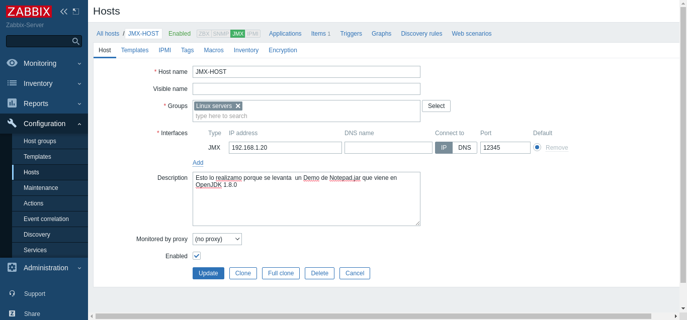

Agregar elemento de agente JMX
++++++++++++++++++++++++++++++

Para cada contador JMX que le interese, agregue un elemento de agente JMX adjunto a esa interfaz.
La clave en la captura de pantalla a continuación dice::

	jmx["java.lang:type=Memory","HeapMemoryUsage.used"]

	service:jmx:rmi:///jndi/rmi://{HOST.CONN}:{HOST.PORT}/jmxrmi

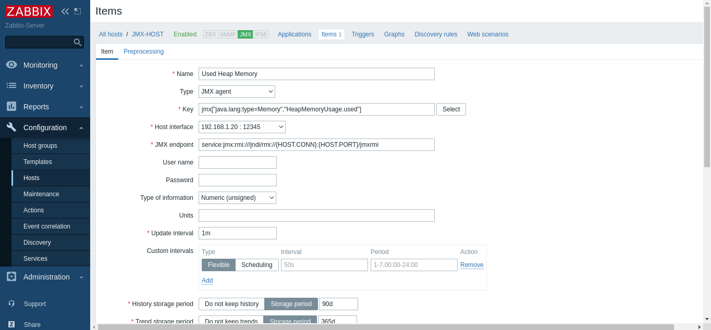

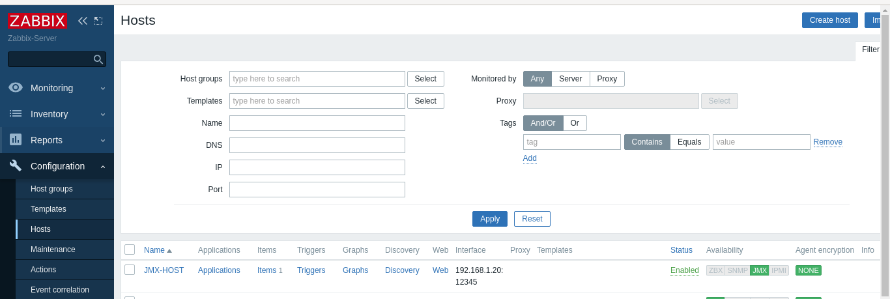

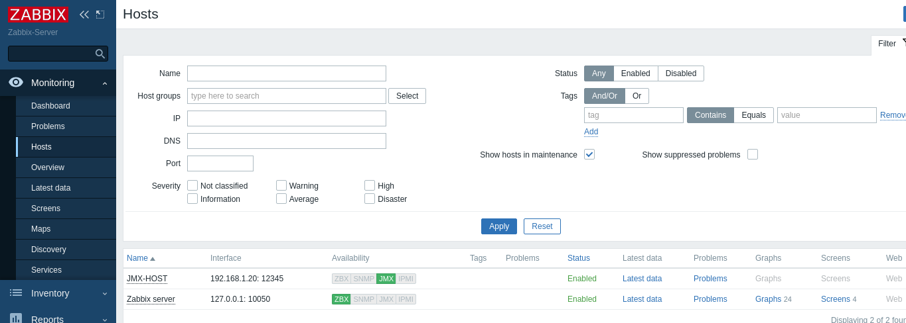

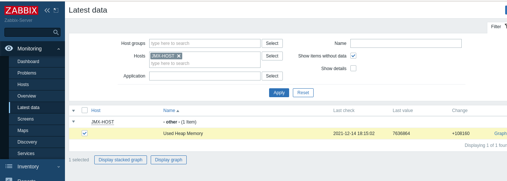

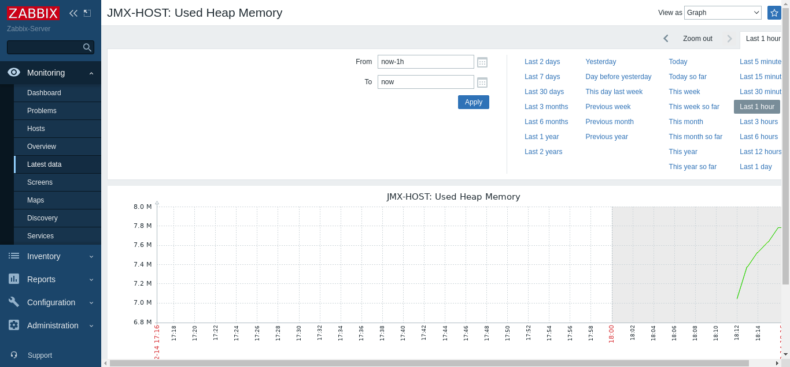

Hagamos otro ejercicio funcional
==============================

Instalar un Tomcat, puede utilizar este link para instalarlo.

https://github.com/cgomeznt/Tomcat/blob/master/guia/instalar_tomcat7.rst

Y para habilitar el JMX en el Tomcat puede ver este otro link.

https://github.com/cgomeznt/Tomcat/blob/master/guia/jmxremote.rst

En el servidor de Zabbix creamos un Host

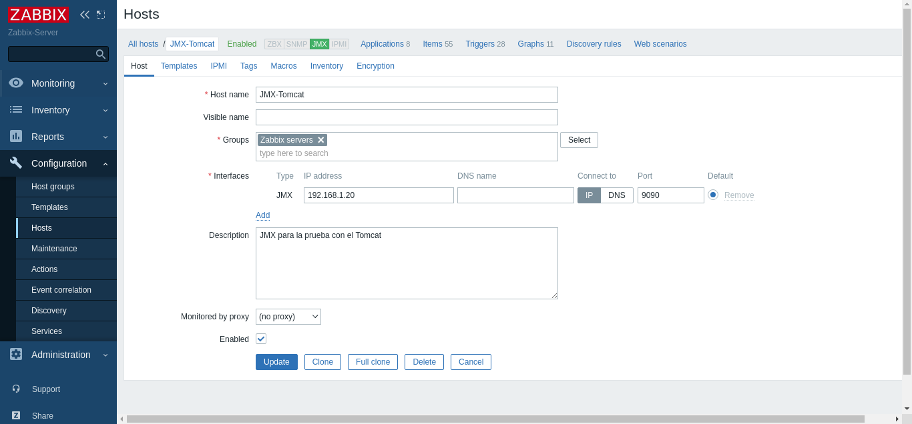

Al Host creado le asignamos un template llamado "Template App Generic Java JMX"

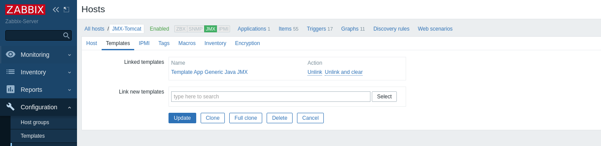

Luego de agregar el Template esperamos unos minutos y se va ver como ahora el Host tiene varios Items y Triggers

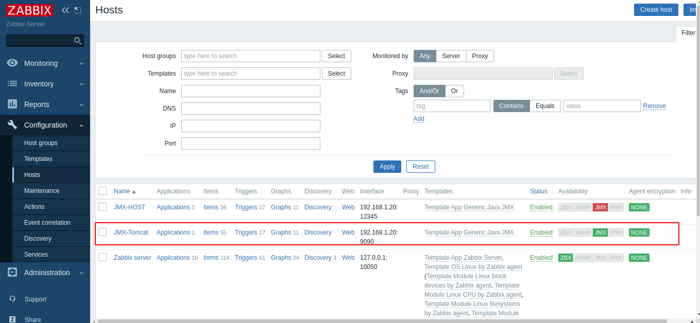

Luego podemos ir a Monitoreo y seleccionar el Host y podemos ver **Last data** o **Graphs**

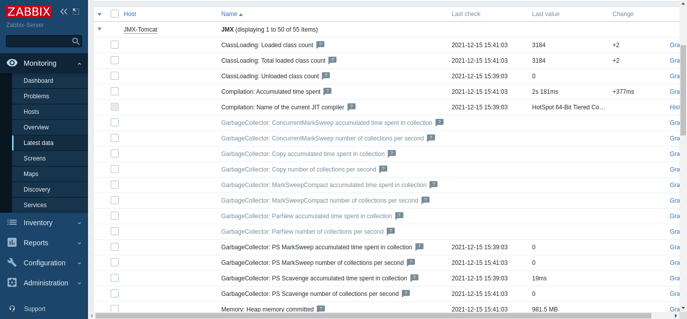

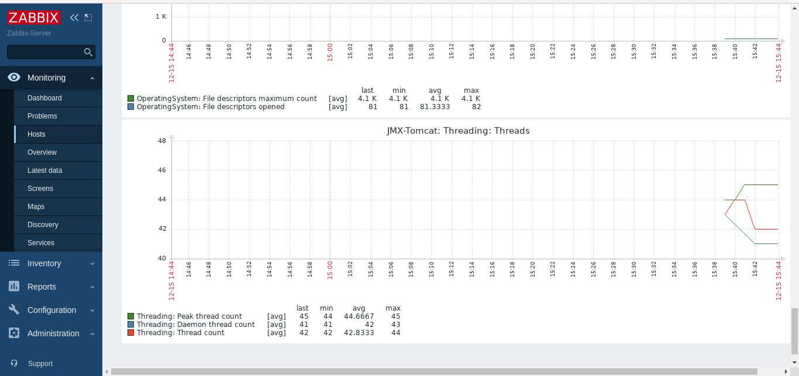

