Low Level Discovery (LLD)
==========================

Low-level discovery. El descubrimiento de bajo nivel proporciona una forma de crear automáticamente elementos, disparadores y gráficos para diferentes entidades en una computadora

Que es lo que se quiere descubrir
++++++++++++++++++++++++++++++++++

Lo primero que se debe tener claro es, ¿que es lo que se quiere descubrir? y luego esa salida la tenemos que llevar a un formato JSON
Ejemplo Queremos saber los puertos que se están iniciando con una aplicación.

En el archivo "port_list.txt" tenemos ya almacenado un listado de los puertos que requerimos verificar, es decir, estar seguros que están iniciados (Previo hubo un script que genero este archivo).::

	# cat /home/oracle/scm/port_list.txt | grep -v \# | awk '{print $1}'
	7019
	7021
	7022
	7023
	7024
	7025
	7026
	7028
	7029
	7030
	7031
	7032
	7035
	7036
	7040
	7043
	7044
	7050
	7054
	7055

Ya que tenemos un script que descubre los puertos, ahora debemos convertir dicha salida en un formato JSON con esta estructura.::

	{"data":[
		        {"{#ITEM}":"PORT1"},
		        {"{#ITEM}":"PORT2"},
		        {"{#ITEM}":"PORT3"}
	]}

Verificamos que estemos teniendo la salida requerida.::

	# echo '{"data":[';for i in $(cat /home/oracle/scm/port_list.txt | grep -v \# | awk '{print $1}') ;do echo "{\"{#ITEM}\": \"$i\"},";done | sed  '$ s/.$//' ; echo ']}'
	{"data":[
	{"{#ITEM}": "7019"},
	{"{#ITEM}": "7021"},
	{"{#ITEM}": "7022"},
	{"{#ITEM}": "7023"},
	{"{#ITEM}": "7024"},
	{"{#ITEM}": "7025"},
	{"{#ITEM}": "7026"},
	{"{#ITEM}": "7028"},
	{"{#ITEM}": "7029"},
	{"{#ITEM}": "7030"},
	{"{#ITEM}": "7031"},
	{"{#ITEM}": "7032"},
	{"{#ITEM}": "7035"},
	{"{#ITEM}": "7036"},
	{"{#ITEM}": "7040"},
	{"{#ITEM}": "7043"},
	{"{#ITEM}": "7044"},
	{"{#ITEM}": "7050"},
	{"{#ITEM}": "7054"},
	{"{#ITEM}": "7055"},
	{"{#ITEM}": "7057"}
	]}

Preferiblemente el comando anterior lo colocamos en un script.::

	vi /usr/local/bin/zabbix/discover-ambientes.sh
	#!/bin/bash
	echo '{"data":[';for i in $(cat /home/oracle/scm/port_list.txt | grep -v \# | awk '{print $1}') ;do echo "{\"{#ITEM}\": \"$i\"},";done | sed  '$ s/.$//' ; echo ']}'

Ejecutamos el comando y lo enviamos a un archivo temporal.::

	/usr/local/bin/zabbix/discover-ambientes.sh > /tmp/discovered_ambientes.json

Ya bien identificado el comando, la creación del script y su salida en formato JSON, debemos ahora introducirlo en el agente de zabbix.

En el archivo de configuración del zabbix "/etc/zabbix/zabbix_agentd.conf" debemos ubicar la siguiente linea, para saber en donde vamos a crear nuestro archivo de configuración personalizada.::

	Include=/etc/zabbix/zabbix_agentd.d/*.conf

Procedemos a crear nuestra configuración.::

	vi /etc/zabbix/zabbix_agentd.d/ambientes_custom.conf
	UserParameter=ambiente.discovery,cat /tmp/discovered_ambientes.json;
	UserParameter=ambiente.status.[*],/usr/local/bin/discover_ambientes_get.sh $1;

Reiniciamos el agente de zabbix.::

	/etc/init.d/zabbix-agent restart

Obtener el status de lo descubierto
++++++++++++++++++++++++++++++++++++++

Como vimos anteriormente en el archivo "/etc/zabbix/zabbix_agentd.d/ambientes_custom.conf" existe un script que debemos crear "/usr/local/bin/discover_ambientes_get.sh", este script lo que hace es verificar el status del puerto.::

	# vi /usr/local/bin/discover_ambientes_get.sh
		#!/bin/bash
		PUERTO="$1"
		RUNNING=$(netstat -nat | grep -v grep | grep -i listen | grep $PUERTO | wc -l)
		if [ $RUNNING -eq 0 ] ; then
			status="0"
		else
			status="1"
		fi
		echo "$status"

Hacer pruebas desde el servidor Zabbix
++++++++++++++++++++++++++++++++++++++++

Y ahora antes de continuar vamos a realizar unas pruebas desde el servidor de Zabbix. vamos a verificar el 
ambiente.discovery.::

	# zabbix_get -s 192.168.0.4 -k 'ambiente.discovery'
	{"data":[
	{"{#ITEM}": "7019"},
	{"{#ITEM}": "7021"},
	{"{#ITEM}": "7022"},
	{"{#ITEM}": "7023"},
	{"{#ITEM}": "7024"},
	{"{#ITEM}": "7025"},
	{"{#ITEM}": "7026"},
	{"{#ITEM}": "7028"},
	{"{#ITEM}": "7029"},
	{"{#ITEM}": "7030"},
	{"{#ITEM}": "7031"},
	{"{#ITEM}": "7032"},
	{"{#ITEM}": "7035"},
	{"{#ITEM}": "7036"},
	{"{#ITEM}": "7040"},
	{"{#ITEM}": "7043"},
	{"{#ITEM}": "7044"},
	{"{#ITEM}": "7050"},
	{"{#ITEM}": "7054"},
	{"{#ITEM}": "7055"},
	{"{#ITEM}": "7057"}
	]}

Ahora con el status y verificamos un puerto que este operativo y otro no. El puerto 7027 NO esta operativo y el puerto 7019 esta operativo.

ambiente.status.::

	# zabbix_get -s 192.168.0.4 -k 'ambiente.status.[7027]'
	  0
	# zabbix_get -s 192.168.0.4 -k 'ambiente.status.[7019]'
	  1

Crear el Template
++++++++++++++++++

Crear un nuevo **template** y configurar un  **Discovery rule**::

	Type: Zabbix Agent
	Key: ambiente.discovery
	Keep lost resources period (in days): 0
	If you wish to retain data in Zabbix from deleted files, set this value higher than 0

Creamos el template.

.. figure:: ../images/llc/01.png

Llenamos los campos "Template name", "Visible name", asignamos el grupo de "Template" y pulsamos el botón "Add". Importante tomar en cuenta los intervalos y esto depende de nuestro criterio.

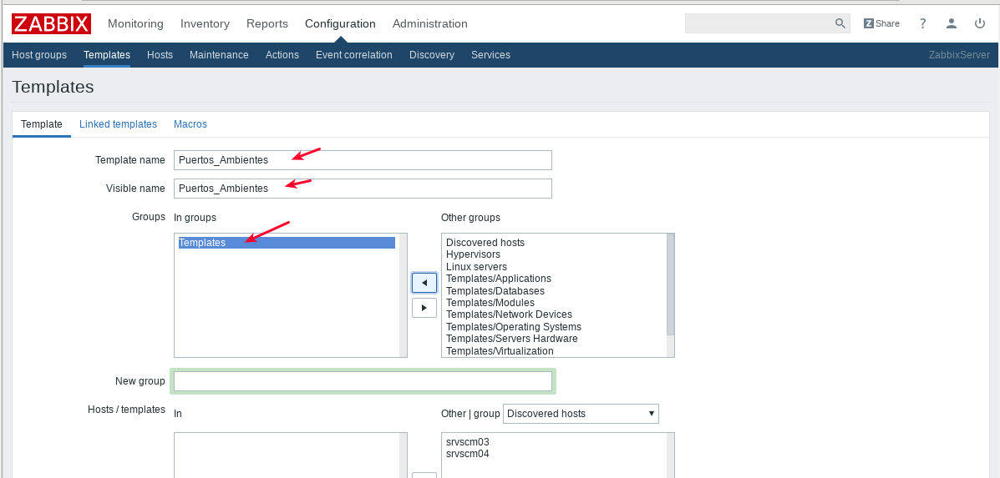

Se Ingresa al Template creado por nosotros.

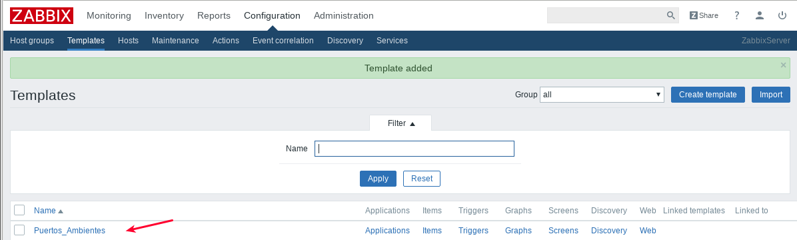

Luego de seleccionar el Template creado, pulsamos sobre el link "Discovery rules" y en esa ventana pulsamos sobre el botón "Create discovery rule"

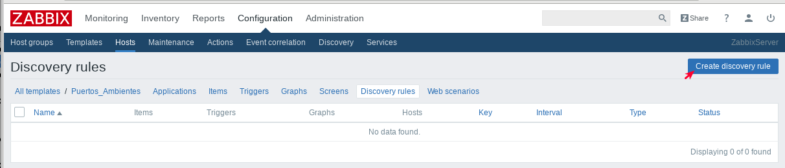

Creamos la Regla que hace el descubrimiento de los ITEMS y pulsamo sobre el botón "Add"

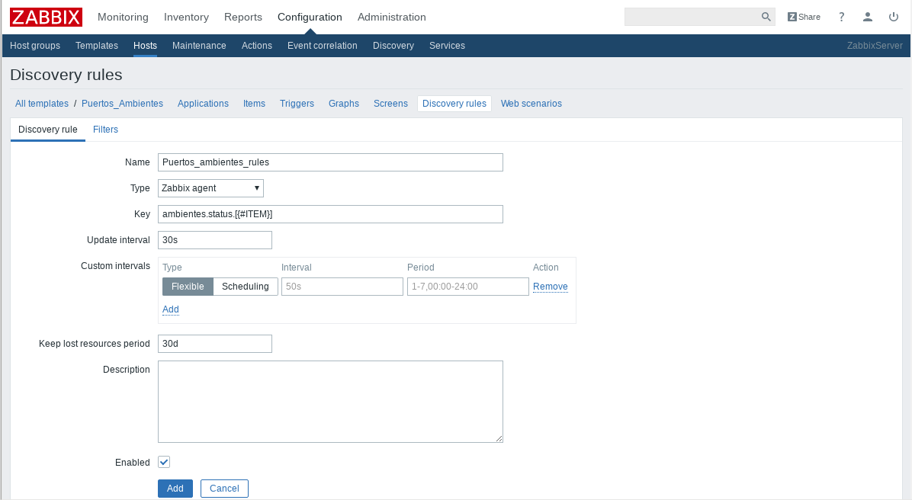

Se agrega el Discorey rule Creado por nosotros

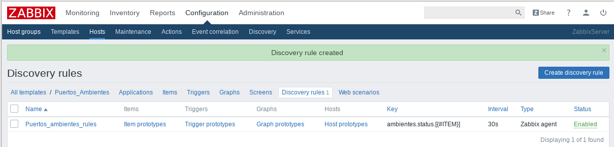

Crear un **item prototype**::

	Type: Zabbix Agent
	Key: ambiente.discovery.status.[{#ITEM}]
	STRING should be the value you are looking for, in this case, ITEM.
	Type of information: Numeric (unsigned)
	Data type: Decimal

En el mismo Template creado por nosotros, pulsamos sobre el link "Item prototypes" y pulsamos sobre el botón "Create item prototype"

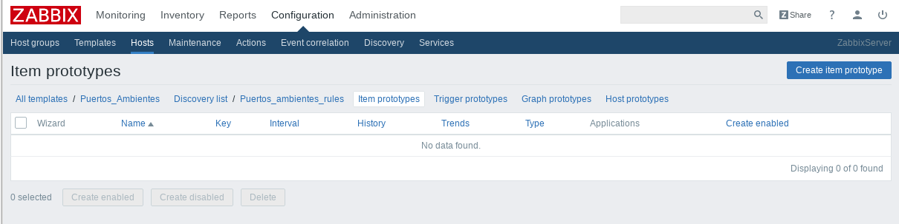

Llenamos los campos "Name", "Visible name", "Type", "Key" y pulsamos el botón "Add". Importante tomar en cuenta los intervalos y esto depende de nuestro criterio.

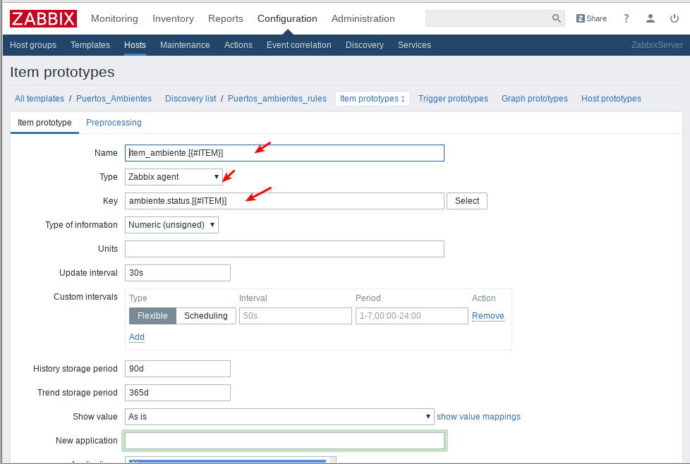

Se agrega el "Item prototype" Creado por nosotros

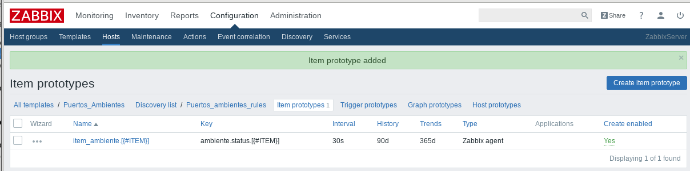

Retornamos en donde estan los Templates y podemos observar ahora como nuestro Template tiene un Discovery Rule

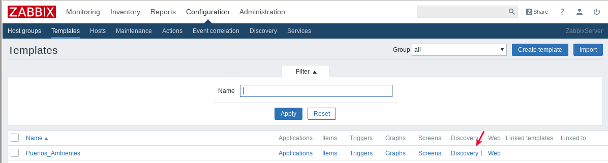

Asociar el template al host
+++++++++++++++++++++++++++

Ahora asociamos el template al HOST y debemos esperar a que se realice el Discover y comience a verificar el status.

Nos vamos a cada uno de los HOST que necesitamos tenga el Template creado por nosotros.

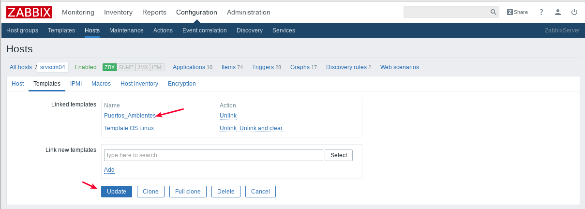

En "Configuration" "HOSTS" observamos como el servidor que tiene 3 Discovery rules y solo tiene 75 Items

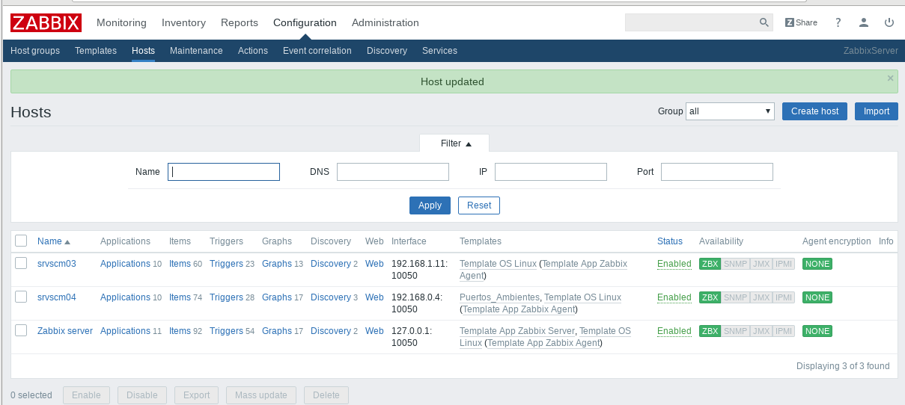

Luego de esperar un rato podemos observar como el mismo servidor que tenia 3 Discovery rules ahora tiene 95 Items

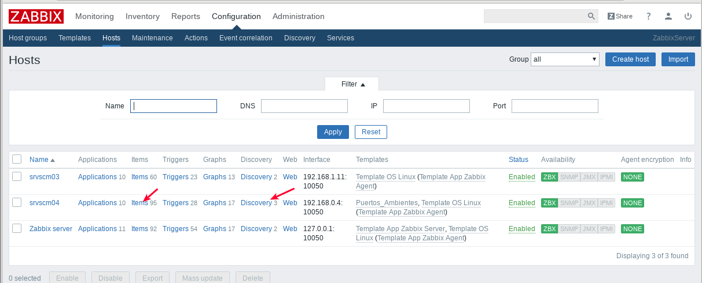

Y podemos ahora ver en los Items del servidor como fueron agregados los Item discovered.

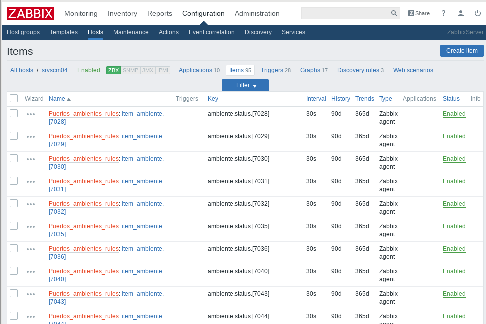

