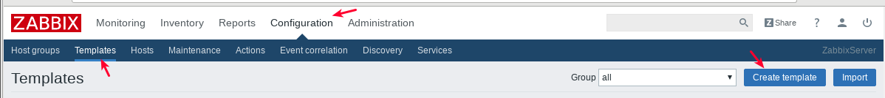
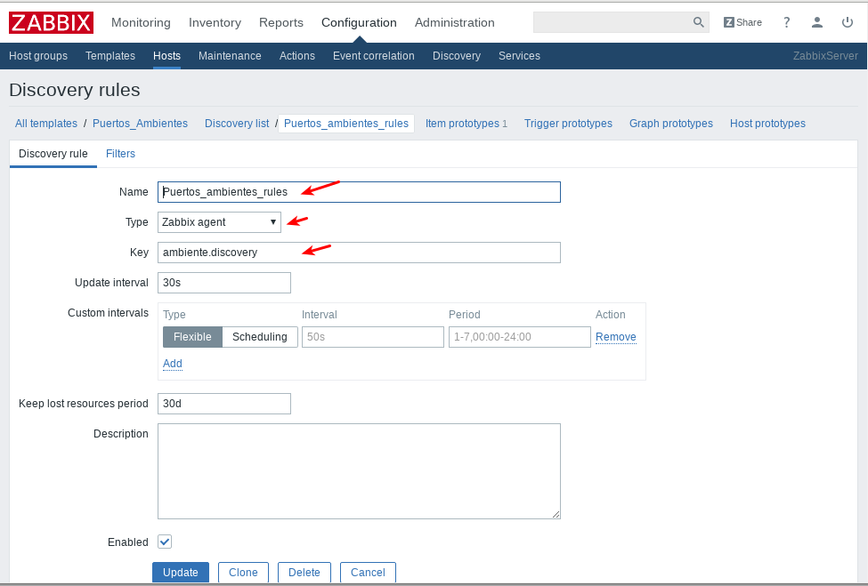

Low Level Discovery (LLD)
==========================

Que es lo que se quiere descubrir
++++++++++++++++++++++++++++++++++

Lo primero que se debe tener claro es qeu es lo que se quiere descubir y luego esa salida la tenemos que llevar a un formato JSON
Ejemplo Queremos saber los puertos que se estan iniciando con una aplicación.

En el archivo "port_list.txt" tenemos ya almacenado un listado de los puertos que requerimos verificar, es decir, estar seguros que estan iniciados.::

	# cat /home/oracle/scm/port_list.txt | grep -v \# | awk '{print $1}'
	7019
	7021
	7022
	7023
	7024
	7025
	7026
	7028
	7029
	7030
	7031
	7032
	7035
	7036
	7040
	7043
	7044
	7050
	7054
	7055

Ya que tenemos una Herramienta o script que descubre los puertos, ahora debemos convertir dicha salida en un formato JSON con esta estructura.::

	{"data":[
		        {"{#ITEM}":"PORT1"},
		        {"{#ITEM}":"PORT2"},
		        {"{#ITEM}":"PORT3"}
	]}

Verificamos que estemos teniendo la salida requerida.::

	# echo '{"data":[';for i in $(cat /home/oracle/scm/port_list.txt | grep -v \# | awk '{print $1}') ;do echo "{\"{#ITEM}\": \"$i\"},";done | sed  '$ s/.$//' ; echo ']}'
	{"data":[
	{"{#ITEM}": "7019"},
	{"{#ITEM}": "7021"},
	{"{#ITEM}": "7022"},
	{"{#ITEM}": "7023"},
	{"{#ITEM}": "7024"},
	{"{#ITEM}": "7025"},
	{"{#ITEM}": "7026"},
	{"{#ITEM}": "7028"},
	{"{#ITEM}": "7029"},
	{"{#ITEM}": "7030"},
	{"{#ITEM}": "7031"},
	{"{#ITEM}": "7032"},
	{"{#ITEM}": "7035"},
	{"{#ITEM}": "7036"},
	{"{#ITEM}": "7040"},
	{"{#ITEM}": "7043"},
	{"{#ITEM}": "7044"},
	{"{#ITEM}": "7050"},
	{"{#ITEM}": "7054"},
	{"{#ITEM}": "7055"},
	{"{#ITEM}": "7057"}
	]}

Preferiblemente el comando anterior lo colocamos en un script.::

	vi /usr/local/bin/zabbix/discover-ports.sh

Ejecutamos el comando y lo enviamos a un archivo temporal.::

	/usr/local/bin/zabbix/discover-ports.sh > /tmp/discover_port.json

Ya bien identificado el comando, la creación del script y su salida en formato JSON, debemos ahora introducirlo en el agente de zabbix.

En el archivo de configuración del zabbix "/etc/zabbix/zabbix_agentd.conf" debemos ubicar la siguiente linea, para saber en donde vamos a crear nuestro archivo de configuracion personalizada.::

	Include=/etc/zabbix/zabbix_agentd.d/*.conf

Procedemos a crear nuestra configuración.::

	vi /etc/zabbix/zabbix_agentd.d/port_custom.conf
	UserParameter=ambiente.discovery,cat /tmp/discover_port.json;
	UserParameter=ambiente.status.[*],/usr/local/bin/discover_port_get.sh $1;

Reiniciamos el agente de zabbix.::

	/etc/init.d/zabbix-agent restart

Obetener el status de lo descubierto
++++++++++++++++++++++++++++++++++++++

Como vimos anteriormente en el archivo "/etc/zabbix/zabbix_agentd.d/port_custom.conf" existe un script que debemos crear "/usr/local/bin/discover_port_get.sh", este script lo que hace es verificar el status del puerto.::

	# vi /usr/local/bin/discover_port_get.sh
		#!/bin/bash
		PUERTO="$1"
		RUNNING=$(netstat -nat | grep -v grep | grep -i listen | grep $PUERTO | wc -l)
		if [ $RUNNING -eq 0 ] ; then
			status="0"
		else
			status="1"
		fi
		echo "$status"

Hacer pruebas desde el servidor Zabbix
++++++++++++++++++++++++++++++++++++++++

Y ahora antes de continuar vamos a realizar unas pruebas desde el servidor de Zabbix. vamos a verificar el 
ambiente.discovery.::

	# zabbix_get -s 192.168.0.4 -k 'ambiente.discovery'
	{"data":[
	{"{#ITEM}": "7019"},
	{"{#ITEM}": "7021"},
	{"{#ITEM}": "7022"},
	{"{#ITEM}": "7023"},
	{"{#ITEM}": "7024"},
	{"{#ITEM}": "7025"},
	{"{#ITEM}": "7026"},
	{"{#ITEM}": "7028"},
	{"{#ITEM}": "7029"},
	{"{#ITEM}": "7030"},
	{"{#ITEM}": "7031"},
	{"{#ITEM}": "7032"},
	{"{#ITEM}": "7035"},
	{"{#ITEM}": "7036"},
	{"{#ITEM}": "7040"},
	{"{#ITEM}": "7043"},
	{"{#ITEM}": "7044"},
	{"{#ITEM}": "7050"},
	{"{#ITEM}": "7054"},
	{"{#ITEM}": "7055"},
	{"{#ITEM}": "7057"}
	]}

Ahora con el status y verificamos un puerto que este operativo y otro no
ambiente.status.::

	# zabbix_get -s 192.168.0.4 -k 'ambiente.status.[7027]'
	0
	# zabbix_get -s 192.168.0.4 -k 'ambiente.status.[7019]'
	1

Crear el Template
++++++++++++++++++

Crear un nuevo **template** y configurar un  **Discovery rule**::

	Type: Zabbix Agent
	Key: ambiente.discovery
	Keep lost resources period (in days): 0
	If you wish to retain data in Zabbix from deleted files, set this value higher than 0

Crear un **item prototype**::

	Type: Zabbix Agent
	Key: ambiente.discovery.status.[{#ITEM}]
	STRING should be the value you are looking for, in this case, ITEM.
	Type of information: Numeric (unsigned)
	Data type: Decimal

Asociar el template al host
+++++++++++++++++++++++++++

Ahora asociamos el template al HOST y debemos esperar a que se realice el Discover y comience a verificar el status.

