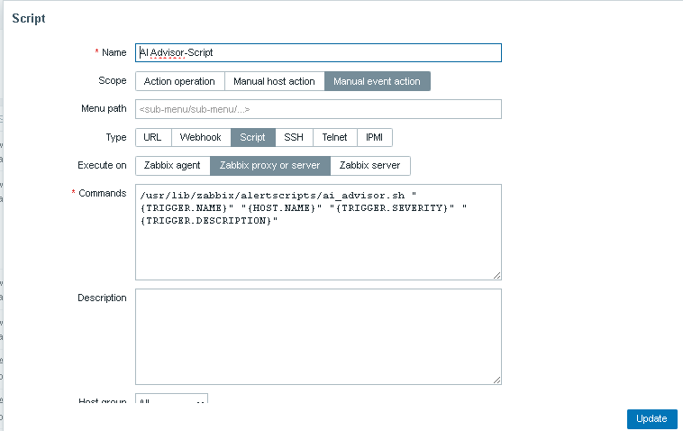
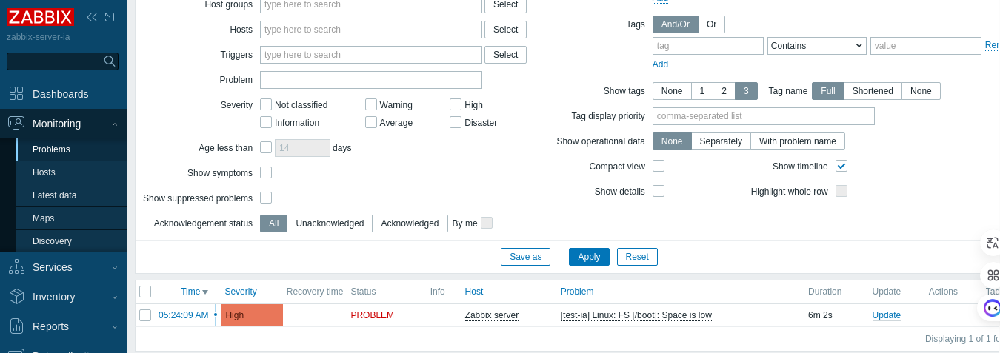
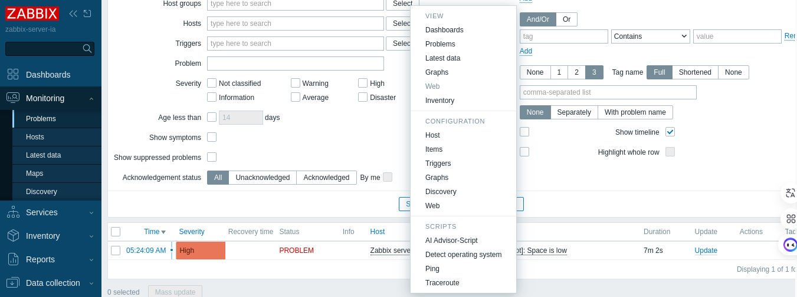
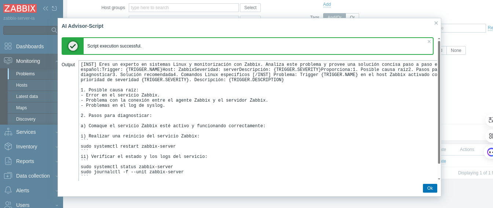

=====================================================
Integración Zabbix + ollama local con docker compose y bash script
=====================================================

.. contents:: Tabla de Contenidos
   :depth: 3
   :local:

Integrar Zabbix con la IA de ollama usando el modelo llama3, el cual esaccesibles en Venezuela, usando scripts bash para GNU/Linux y docker compose.

Opciones de IA disponibles en Venezuela
----------------------------------------
OpenRouter.ai (accesible y con modelos gratuitos)

Hugging Face (algunos modelos son accesibles)

LocalAI (instalar modelos locales)

ollama (instalar modelos locales)

Solución a utilizar en esta paso a paso: ollama, con el modelo llama3

Requisitos Previos
------------------

* Docker instalado en tu sistema
* Conocimientos básicos de línea de comandos.
* 32GB de RAM disponibles (recomendado para mejores resultados)

Estructura final del proyecto
-----------------------------------

.. code-block:: bash

::

   ollama-assistant/
   ├── docker-compose.yml
   ├── Dockerfile
   ├── requirements.txt
   ├── app.py
   ├── index.html
   ├── nginx.conf
   ├── uploads/   (creado automáticamente)
   ├── db/         (creado automáticamente)
   └── docs/
       └── contactos.txt

Paso 2: Configuración inicial de Docker
---------------------------------------

Verifica que Docker esté instalado y funcionando:

.. code-block:: bash

   docker --version
   docker run hello-world

Crea una carpeta para tu proyecto:

.. code-block:: bash

   mkdir ollama-assistant && cd ollama-assistant

Paso 2: Configuración de Ollama en Docker
-----------------------------------------

Descarga la imagen de Ollama:

.. code-block:: bash

   docker pull ollama/ollama

Crea un volumen para persistir los modelos:

.. code-block:: bash

   docker volume create ollama_data

Inicia el contenedor de Ollama:

.. code-block:: bash

   docker run -d --name ollama -p 11434:11434 -v ollama_data:/root/.ollama ollama/ollama

Paso 3: Descargar e instalar un modelo de lenguaje
--------------------------------------------------

Descarga un modelo adecuado (por ejemplo, llama3 o mistral):

.. code-block:: bash

   docker exec ollama ollama pull llama3

(Este paso puede tomar varios minutos dependiendo de tu conexión a internet)

Verifica que el modelo se haya descargado correctamente:

.. code-block:: bash

   docker exec ollama ollama list

Paso 1: Crear estructura de directorios
------------------------------------------

.. code-block:: bash

  mkdir -p /var/lib/docker/asistente_ti/ollama-assistant/{models,uploads}

Paso 2: Crear archivo docker-compose.yml
------------------------------------------

Crea el archivo en ~ollama-docker/docker-compose.yml con:

  version: '3.8'
  
  services:
    ollama:
      image: ollama/ollama
      ports:
        - "11434:11434"
      volumes:
        - ./models:/root/.ollama
        - ./uploads:/uploads
        - ollama_data:/root/.ollama
      restart: unless-stopped
  
    assistant:
      build: .
      ports:
        - "8000:8000"
        - "80:80"
      volumes:
        - ./uploads:/app/uploads
        - ./db:/app/db
      depends_on:
        - ollama
      environment:
        - OLLAMA_HOST=http://ollama:11434
      restart: unless-stopped
  
  volumes:
    ollama_data:

Paso 3: Crear script bash para consultar la IA
--------------------------------------------------
Crear el archivo /usr/lib/zabbix/alertscripts/ai_advisor.sh, en el servidor de Zabbix:

.. code-block:: bash

  #!/bin/bash
  
  # ConfiguracióLLAMA_HOST="http://localhost:11434"  # URL de tu instancia Ollama
  MODEL="llama3"  # Modelo que tienes descargado en Ollama
  OLLAMA_HOST="10.134.4.13:11434"
  ZABBIX_TRIGGER_NAME="$1"
  ZABBIX_HOSTNAME="$2"
  ZABBIX_SEVERITY="$3"
  ZABBIX_DESCRIPTION="$4"
  
  if [[ "$ZABBIX_TRIGGER_NAME" == *"[Sop Ops IST]"* ]]; then
      echo "No puedo hacer nada...!!!, Personal de Soporte Operaciones de IST debe Proporciona:
  1. Posible causa raíz
  2. Pasos para diagnosticar
  3. Solucióecomendada
  4. Comandos Linux especícos"
      exit 0
  fi
  
  CACHE_DIR="/var/cache/zabbix/ollama"
  mkdir -p "$CACHE_DIR"
  CACHE_FILE="$CACHE_DIR/$(echo "${ZABBIX_TRIGGER_NAME}:${ZABBIX_HOSTNAME}:${ZABBIX_DESCRIPTION}" | md5sum | cut -d' ' -f1)"
  
  # Verificar cachévádo por 1 hora)
  if [ -f "$CACHE_FILE" ] && [ $(($(date +%s) - $(stat -c %Y "$CACHE_FILE"))) -lt 3600 ]; then
      SOLUTION=$(cat "$CACHE_FILE")
      echo "[CACHED] $SOLUTION"
      exit 0
  fi
  
  
  #echo "trigger $ZABBIX_TRIGGER_NAME, Hostname $ZABBIX_HOSTNAME, severidad $ZABBIX_SEVERITY"
  
  # Preparar el prompt (formato Mistral compatible)
  PROMPT="[INST] Eres un experto en sistemas Linux y monitorizacióon Zabbix. Analiza este problema y provee una solucióoncisa paso a paso en españ
  
  Trigger: ${ZABBIX_TRIGGER_NAME}
  #Host: ${ZABBIX_HOSTNAME}
  Severidad: ${ZABBIX_SEVERITY}
  #Descripció${ZABBIX_DESCRIPTION}
  
  Proporciona:
  #1. Posible causa raí2. Pasos para diagnosticar
  3. Solucióecomendada [/INST]
  #4. Comandos Linux especícos [/INST]"
  
  # Formatear el prompt como JSON para la API
  JSON_DATA=$(jq -n --arg prompt "$PROMPT" '{
    model: "'"$MODEL"'",
      prompt: $prompt,
        stream: false
  }')
  
  # Consultar la API de Ollama usando cURL
  RESPONSE=$(curl -s -X POST \
            "${OLLAMA_HOST}/api/generate" \
              -H "Content-Type: application/json" \
                -d "$JSON_DATA")
  
  # Extraer y formatear la respuesta
  SOLUTION=$(echo "$RESPONSE" | jq -r '.response' | sed -e 's/^[[:space:]]*//' -e 's/[[:space:]]*$//')
  
  # Guardar en cache
  echo "$SOLUTION" > "$CACHE_FILE"
  
  # Manejo de errores báco
  if [ -z "$SOLUTION" ] || [ "$SOLUTION" = "null" ]; then
            SOLUTION="Error: No se pudo obtener una respuesta del modelo. Detalles: $RESPONSE"
  fi
  
  
  # Enviar a Zabbix y registrar en log
  echo "$SOLUTION"
  mkdir -p /var/log/zabbix
  echo "$(date) - ${ZABBIX_HOSTNAME} - ${ZABBIX_TRIGGER_NAME}: ${SOLUTION}" >> /var/log/zabbix/ai_advisor.log
  exit 0

Paso 4: Dar permisos al script
---------------------------------

.. code-block:: bash

   chmod +x /usr/lib/zabbix/alertscripts/ai_advisor.sh
   chown zabbix:zabbix /usr/lib/zabbix/alertscripts/ai_advisor.sh
   mkdir -p /var/log/zabbix
   touch /var/log/zabbix/ai_advisor.log
   chown zabbix:zabbix /var/log/zabbix/ai_advisor.log

Paso 5: Instalar dependencias
--------------------------------

.. code-block:: bash

   apt-get install jq curl  # Para Debian/Ubuntu
   # o
   yum install jq curl      # Para RHEL/CentOS

6. Configurar un Scripts personalizado en Zabbix:
-----------------------------------------------

En la interfaz web de Zabbiz ir a "Alerts" → "Scripts".

   Crear un nuevo Scripts llamado **AI Advisor-Script** con los siguientes parametros. 

   Scope: **Manual event action**
   
   Type: **Script**
   
   Execute on:** Zabbix proxy or server**
   
   Commands: **/usr/lib/zabbix/alertscripts/ai_advisor.sh "{TRIGGER.NAME}" "{HOST.NAME}" "{TRIGGER.SEVERITY}" "{TRIGGER.DESCRIPTION}"**
   
   Lo salvamos

7. Probamos el funcionamiento de script:
-----------------------------------------------

Debemos generar una alarma para que se muestre en **Problems**. (En este ejemplo creamos un ITEM del tipo Zabbix Trapper y un TRIGGER.

Desde la terminal del servidor de Zabbix ejecutamos el **zabbix_sender**

Para activar la alarma:

.. code-block:: bash

   zabbix_sender -vv -z localhost -p 10051 -s "Zabbix server" -k ia_advisor -o 1

Para resolver la alarma:

.. code-block:: bash

   zabbix_sender -vv -z localhost -p 10051 -s "Zabbix server" -k ia_advisor -o 1

Aparece en **Problems** una alarma como esta:

Hacemos clic sobre el nombre del servidor y luego clic en el pop-up en sobre **AI Advisor-Script**

Aparecera un ventana con la información que nos suministra la IA de ollama del modelo llama3. 

**NOTA:** Tenga calma, esto sale a consultar a la IA de ollama, con el modelo llama3

Crea un nuevo script /usr/lib/zabbix/alertscripts/send_solution.sh (opcional):

.. code-block:: bash

   #!/bin/bash
   
   EMAIL="$1"
   SUBJECT="Solución para problema en Zabbix: $2"
   MESSAGE="$3"
   
   # Para email (requiere mailx configurado)
   echo "$MESSAGE" | mailx -s "$SUBJECT" "$EMAIL"
   
   # O para Telegram (opcional)
   # TELEGRAM_TOKEN="tu_token"
   # TELEGRAM_CHAT_ID="tu_chat_id"
   # curl -s -X POST "https://api.telegram.org/bot${TELEGRAM_TOKEN}/sendMessage" \
   #   -d chat_id="${TELEGRAM_CHAT_ID}" \
   #   -d text="${SUBJECT}%0A%0A${MESSAGE}"

Modifica el script ai_advisor.sh para llamar a este script al final:

.. code-block:: bash

   # Añade esto al final del script ai_advisor.sh
   /usr/lib/zabbix/alertscripts/send_solution.sh "tu_email@dominio.com" "${ZABBIX_TRIGGER_NAME}" "${SOLUTION}"

Consideraciones importantes
-------------------------------

Privacidad: No enviar datos sensibles a APIs externas

Costos: ollama, tiene límites gratuitos, monitorear el uso.

Logging: Mantén logs de todas las interacciones para auditoría.

