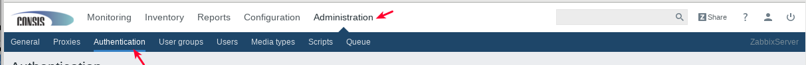
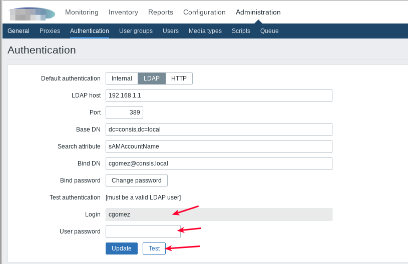

Active Directory Authentication via LDAP Zabbix 3.x 
===================================================

Vamos autenticar los usuarios Active Directory Authentication via LDAP en Zabbix 3.x, Los usuarios que tengan como locales ya no estaran operativos.

Nos vamos a "Administration" y en "Authentication"

Llenamos todos los campos con los datos de nuestro AD.:

LDAP host: 192.168.1.1
Port: 389
Base DN: dc=consis,dc=local
Search attribute: sAMAccountName
Bind DN: cgomez@consis.local
Bind password: ***************

Hacemos un Test authentication para estar seguros que todo esta bien.

