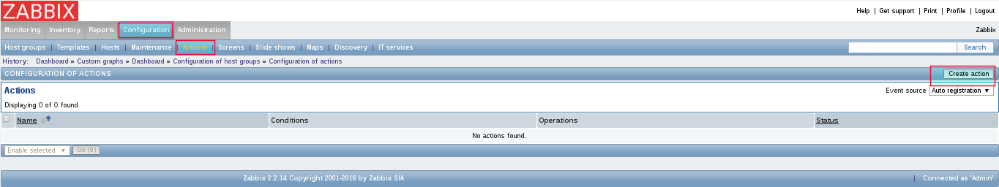
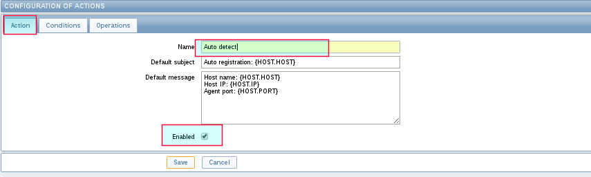
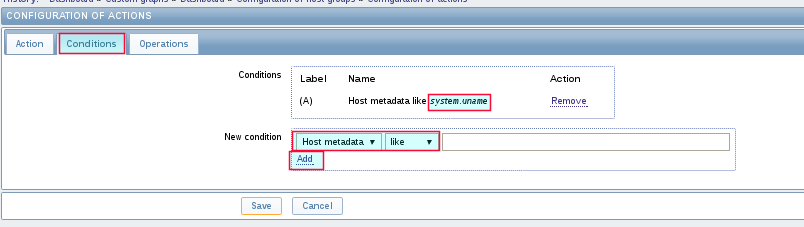
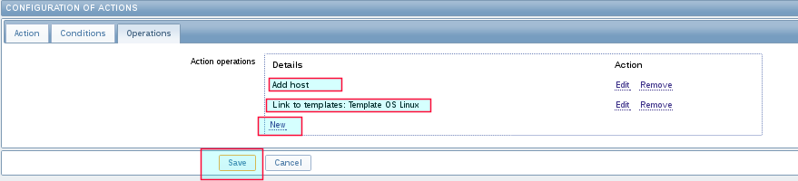
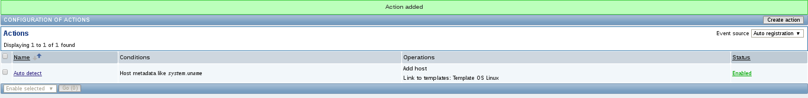
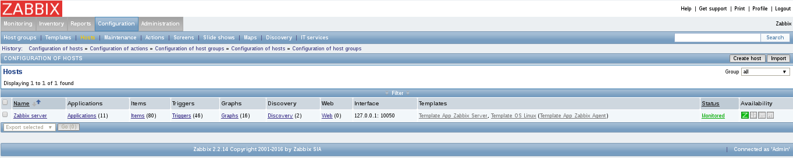
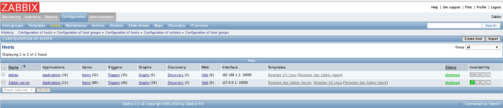

Configurar Auto Registro
=========================

Para que los Host cuando inicien su zabbix agent y se registre de forma automatica en el zabbix server debemos hacer:

Ahora en los zabbix agent de los Host deberan tener como minimo esta configuracion.::

	# vi /etc/zabbix/zabbix_agentd.conf 

	PidFile=/var/run/zabbix/zabbix_agentd.pid
	LogFile=/var/log/zabbix/zabbix_agentd.log
	LogFileSize=0
	Server=192.168.1.5	# Tiene que ser la IP del zabbix server
	ListenIP=192.168.1.2	# Debe existir y es la IP por donde este Host le va permitir al zabbix server obtener la informacion
	ServerActive=192.168.1.5:10051	# Se debe indicar la IP del zabbix server y el puerto
	HostMetadata=system.uname	# Este es el parametro que configuramos cuando creamos la accion de autodetect
	Include=/etc/zabbix/zabbix_agentd.d/

Vemos en el zabbix server que el Host aun no esta.

Reiniciamos el servicio del zabbix agent en el Host.::

	# tail -f /var/log/zabbix/zabbix_agentd.log &

	# /etc/init.d/zabbix-agent restart
	[....] Restarting zabbix-agent (via systemctl): zabbix-agent.service  8791:20161001:110146.535 Got signal [signal:15(SIGTERM),sender_pid:8833,sender_uid:0,reason:0]. Exiting ...
	  8791:20161001:110146.538 Zabbix Agent stopped. Zabbix 2.2.14 (revision 61184).
	  8839:20161001:110146.573 Starting Zabbix Agent [debian]. Zabbix 2.2.14 (revision 61184).
	  8839:20161001:110146.573 using configuration file: /etc/zabbix/zabbix_agentd.conf
	  8840:20161001:110146.574 agent #0 started [collector]
	  8841:20161001:110146.574 agent #1 started [listener #1]
	  8843:20161001:110146.574 agent #2 started [listener #2]
	  8844:20161001:110146.575 agent #3 started [listener #3]
	  8845:20161001:110146.575 agent #4 started [active checks #1]
	. ok 
	8799:20161001:110117.231 no active checks on server [192.168.1.5:10051]: host [debian] not found

El error que vemos en el log es solo por la primera vez, luego si reinicia nuevamente ya no veras ese log.

Vemos si se registro con exito.

