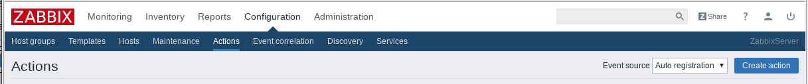
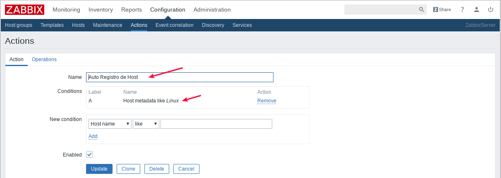
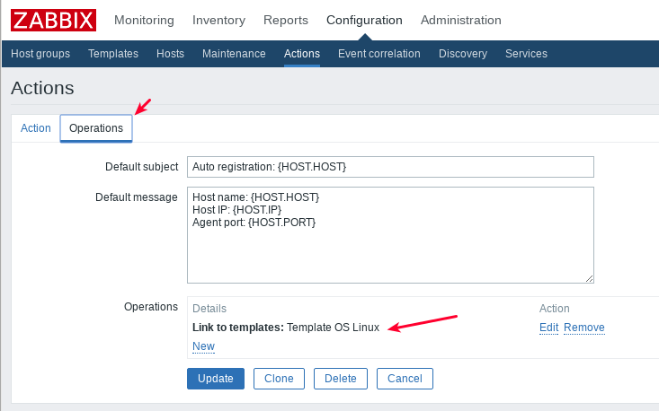

Configurar ZABBIX 3.4 para el Auto registro de HOSTs
======================================================

Configurar ZABBIX 3.4 para el Auto registro, lo que permite qeu solo con la configuración en los host del archivo "zabbix_agent.conf" dicho equipo se registre en el Zabbix Server.

Configurando el Zabbix Server
+++++++++++++++++++++++++++++

Ir a "Configuracion" -> "Actions", en "Event source:" seleccionar "Auto registration" y click en el boton "Create Action"

Colocar un nombre y agregar una condición que sea "Host metadata like Linux"

Ir a Operations y agregar la operacion "Link to templates: Template OS Linux"

Listo esta parte en el Zabbix Server, ahora vamos con los Host

Configurando el zabbix_agent en los Host
++++++++++++++++++++++++++++++++++++++++++

Se debe realizar la instalación del zabbix agente en los Host.::

	yum install -y zabbix-agent.x86_64

Y el archivo de configuración "/etc/zabbix/zabbix_agentd.conf" debe tener como minimo::

	PidFile=/var/run/zabbix/zabbix_agentd.pid
	LogFile=/var/log/zabbix/zabbix_agentd.log
	LogFileSize=0
	EnableRemoteCommands=1
	Server=192.168.0.21
	ListenPort=10050
	ListenIP=192.168.0.4
	ServerActive=192.168.0.21:10051
	#HostMetadata=system.uname
	HostMetadataItem=system.uname
	Timeout=30
	AllowRoot=1
	Include=/etc/zabbix/zabbix_agentd.d/*.conf

