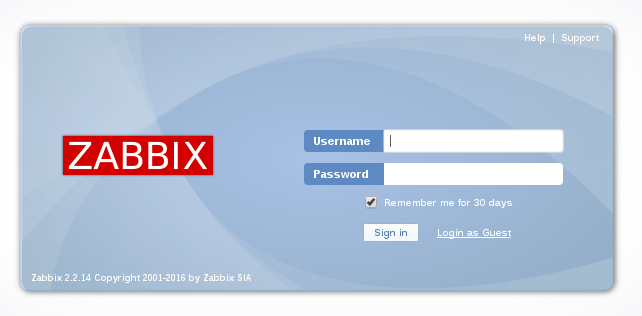

Configurar Zabbix external check
=================================

Creamos un Item dentro del Host

.. figure:: ../images/01.png

.. figure:: ../images/02.png

.. figure:: ../images/03.png

Cuando trabajamos con externalcheck los script deben ser copiados en esta ruta /usr/lib/zabbix/externalscripts/.::

	# ls /usr/lib/zabbix/externalscripts/
	myscript.sh

En el Host se debe crear una ruta en donde deposite la informaciòn qeu queremos evaluar en este ejemplo, creamos el siguiente script dentro del Host y lo activamos con un crontab.::

	# cat /usr/local/bin/get_random.sh
	#!/bin/bash
	echo $RANDOM > /tmp/get_random.txt

Creamos el crontab.::

	# crontab -e
	*/1 * * * *	/bin/bash /usr/local/bin/get_random.sh

Ahora en el servidor zabbix creamos un crontab para que busque los archivos del Host.::

	# crontab -l
	*/1 * * * * /usr/bin/scp -i /keys/id_rsa 192.168.1.3:/tmp/get_random.txt /tmp/

Previo a lo anterior es evidente que debemos crear un ssh-keygen y luego un ssh-copy-id

Ya tenemos los datos del Host en el servidor de zabbix, ahora creamos el script dentro de /usr/lib/zabbix/externalscripts/.::

	# cat /usr/lib/zabbix/externalscripts/myscript.sh 
	#!/bin/bash
	#ps aux | wc -l
	#echo $RANDOM
	cat /tmp/get_random.txt

Por ultimo creamos un grafico dentro de zabbix server.

.. figure:: ../images/04.png

.. figure:: ../images/05.png

.. figure:: ../images/06.png

Ahora ya podemos ver los valores en la grafica.

.. figure:: ../images/07.png

