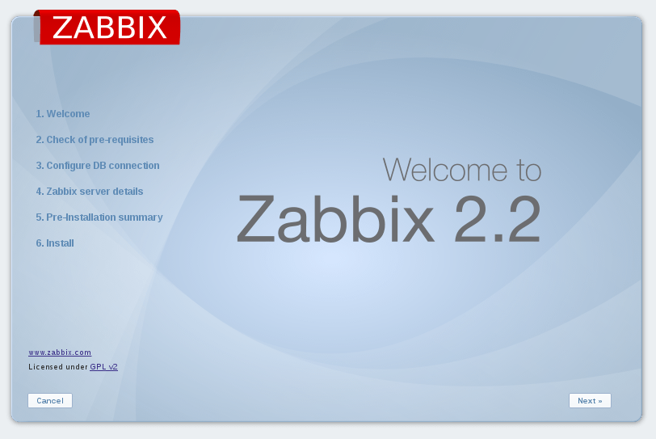
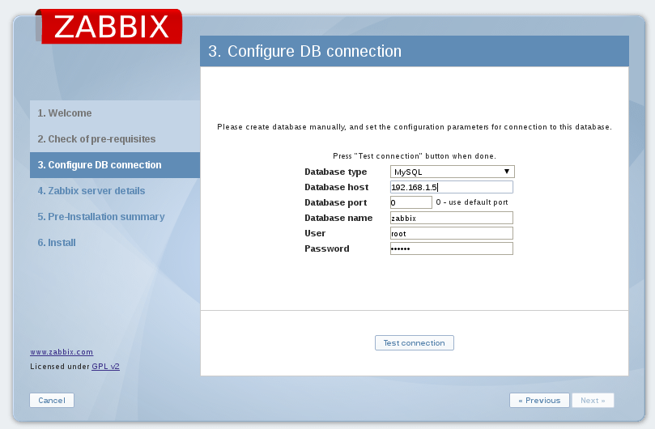

Install Zabbix on Linux
==========================

Caracteristicas principales:
+++++++++++++++++++++++++++++
* Interfaz WEB
* Autenticaciones seguras por usuario.
* Flexibilidad de esquemas para usuarios.
* Agentes de recopilación de datos y seguimiento basado sin agente.
* Soporte de sondeo y captura.
* Zabbix-proxy para recoger de forma centralizada la información y subir al servidor Zabbix.
* Soporte para comandos remotos.
* Software realmente Libre.
* Notificaciones por SMS, Jabber, email, skype, IM, Voice.
* Visualizaciones.

Requerimientos:
+++++++++++++++++
* Memory size: 128 MB 
* Disk size: 256 MB 

Backend database: 
++++++++++++++++++
* MySQL 5.0.3 o anteriores
* PostgreSQL 8.1 o anteriores
* Oracle 10g o anteriores
* SQLite 3.3.5 o anteriores
* IBM DB2 9.7 o anteriores

Zabbix frontend:
+++++++++++++++++++++++++
* Apache 1.3.12 o anteriores
* PHP 5.3.0 o anteriores
* PHP extensions: gd, bcmath, ctype , libXML, xmlreader, xmlwriter, session, sockets, mbstring, gettext, ibm_db2, mysqli, oci8, pgsql, sqlite3
* OS Packages: net-snmp.x86_64, snmp.x86_64, OpenIPMI-libs.x86_64, mysql-server
 
Paquetes a instalar con yum.::

	# yum -y install httpd.x86_64 php.x86_64 php-bcmath.x86_64 php-common.x86_64 php-gd.x86_64 php-mysql.x86_64 php-odbc.x86_64 php-xml.x86_64 php-mbstring

Descargar fping desde URL below.::

	# wget  http://pkgs.repoforge.org/fping/fping-3.1-1.el6.rf.x86_64.rpm
	# rpm ivh fping-3.1-1.el6.rf.x86_64.rpm

Descargar iksemel.::

	# http://repo.zabbix.com/non-supported/rhel/6/x86_64/iksemel-1.4-2.el6.x86_64.rpm

Descargar Zabbix rpm desde http://www.zabbix.com/download.php

Descripcion:
+++++++++++++
* zabbix-agent-*.rpm Agente que se instalara en los clientes de Zabbix.Se debe instalar en cada maquina que se quiera monitorear.
	zabbix-web-*.rpm Interfaz Web para configurar Zabbix server. Viene con dos sabores de Base de Datos.
	zabbix-web-mysql-*.rpm
	zabbix-web-pgsql-*.rpm
* Zabbix-proxy-*.rpm Componente Opcional que recolecta y la sube a Zabbix Server. Viene con tres backend de Base de Datos.
	zabbix-proxy-mysql-*.rpm
	zabbix-proxy-pgsql-*.rpm
	zabbix-proxy-sqlite3-*.rpm
* Zabbix-server-*.rpm Paquete principal de la instalacion de zabbix server. Viene con dos backend de Base de Datos.
	zabbix-server-mysql-*.rpm
	zabbix-server-pgsql-*.rpm
* zabbix-web-*.rpm and Zabbix-server-*.rpm Paquete requerido para ser instalado en el server de Monitoreo.

.::

	# rpm -ivh zabbix-2.4.7-1.el6.x86_64.rpm zabbix-server-2.4.7-1.el6.x86_64.rpm zabbix-server-mysql-2.4.7-1.el6.x86_64.rpm

Instalar zabbix-web.::

	# rpm -ivh zabbix-web-2.4.7-1.el6.noarch.rpm zabbix-web-mysql-2.4.7-1.el6.noarch.rpm

Instalamos el agente para monitorear al mismo server y hacer pruebas.::

	# rpm -ivh zabbix-agent-2.4.7-1.el6.x86_64.rpm

Configurar el backend database para almacenar la data de zabbix. en este ejemplo mysql.::

	# mysql_install_db 

Iniciar mysql database.::

	# /etc/init.d/mysqld start

Corremos el script de seguridad de mysql.::

	# mysql_secure_installation

Iniciar como root.::
	
	# mysql -u root -p

Creamos la base de datos de mysql para zabbix con formato utf8.::

	mysql> Create database zabbix character set utf8;

Creamos el usuario para zabbix.::

	mysql> grant all on zabbix.* to zabbix@'localhost' identified by 'coloca_aqui_un_password';
	mysql> flush privileges;

Configuramos para que pueda escuchar desde la ip que se quiere.::

	# vim /etc/mysql/my.cnf
	Comentamos
	#bind-address           = 127.0.0.1
	#skip-networking

Reiniciamos.::

	# service mysql restart

Otorgamos los permisos y probamos. USERNAME es el usuario que quermos que haga inicio y PASSWORD el password actual de ess usuario y mira la IP.::

	# mysql -root -p

	mysql> GRANT ALL PRIVILEGES ON *.* TO 'USERNAME'@'%' IDENTIFIED BY 'PASSWORD' WITH GRANT OPTION;

	mysql> GRANT ALL PRIVILEGES ON *.* TO 'USERNAME'@'192.168.1.5' IDENTIFIED BY 'PASSWORD' WITH GRANT OPTION;

Listamos los usuarios para ver sus permisos.::

	mysql> SELECT * from information_schema.user_privileges where grantee like "'USERNAME'%";

Y terminamos con.::

	mysql> FLUSH PRIVILEGES;

Hacemos un test.::

	# mysql -h 192.168.1.5 -u root -p

Ahora le creamos los objetos de esquemas requeridos.::

	# cd /usr/share/doc/zabbix-server-mysql-2.4.7/create/
	# mysql -uzabbix -p zabbix < schema.sql
	# mysql -uzabbix -p zabbix < images.sql
	# mysql -uzabbix -p zabbix < data.sql

Editamos zabbix_server.conf para configurar la database IP, User y client.::
	
	# vi /etc/zabbix/zabbix_server.conf 
		DBHost=localhost
		DBName=zabbix
		DBUser=zabbix
		DBPassword=(tu_zabbix_password)
	
Modificar el php.ini.::

	# vi /etc/php.ini
		Cambiar estos parametros
		max_execution_time 300
		memory_limit 128M
		post_max_size 16M
		upload_max_filesize 2M
		max_input_time 300
		date.timezone America/Caracas

Iniciar httpd y zabbix-server.::

	# /etc/init.d/httpd start
	# /etc/init.d/zabbix-server start

Colocar los servicio al inicio del booteo.::
	
	# chkconfig httpd on
	# chkconfig zabbix-server on
	# chkconfig mysqld on

Ver el logfile.::

	# tail -f /var/log/zabbix/zabbix_server.log 

Verificar que todos los servicio esten iniciados.

No olvidar el selinux y los Iptables.

Configuracion Web.
+++++++++++++++++++

http://192.168.1.5/Zabbix

.. figure:: ../images/02.png

.. figure:: ../images/04.png

.. figure:: ../images/05.png

.. figure:: ../images/06.png

.. figure:: ../images/07.png

Iniciar session con Admin/zabbix

.. figure:: ../images/08.png

Los archivos de configuracion mas importante son.::

	/etc/zabbix/zabbix_server.conf 
	/etc/zabbix/web/zabbix.conf.php

El zabbix_server.conf contiene toda la configuracion del zabbix server, como la base de datos donde escribira, el puerto de escuchar, etc y el zabbix.conf.php contiene la configuracion de la cual el php se alimentara para hacer las vistas.
Es decir yo puedo configurar en zabbix.conf.php para que muestre una informacion desde una base de datos y en el zabbix_server.conf hago que escriba la informacion recolectada en otra base de datos (Ojo esto no esta bien es solo para ver la diferencia de ambos archivos)
