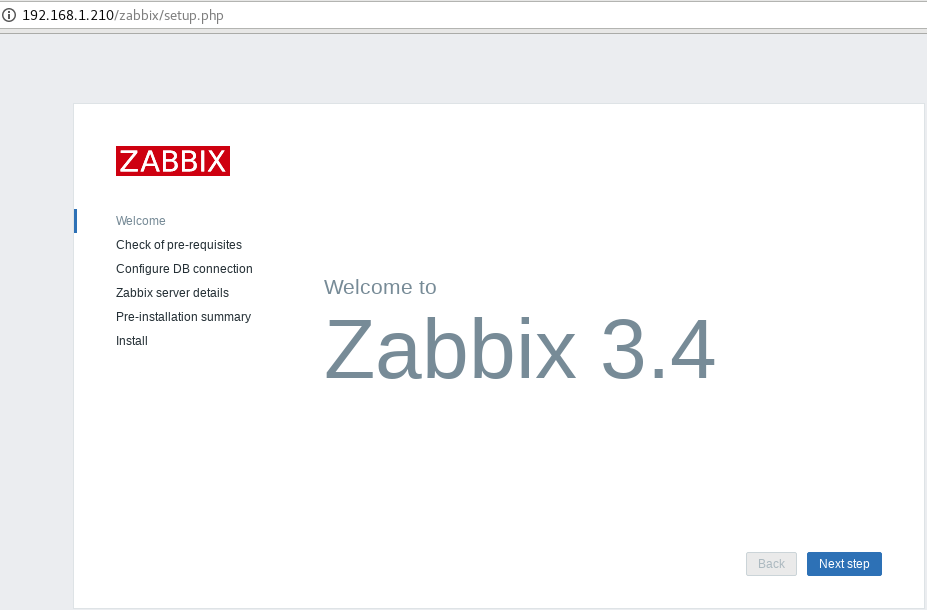
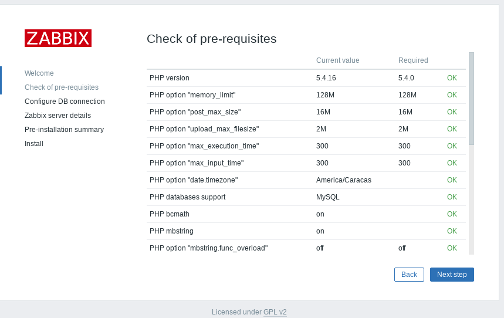
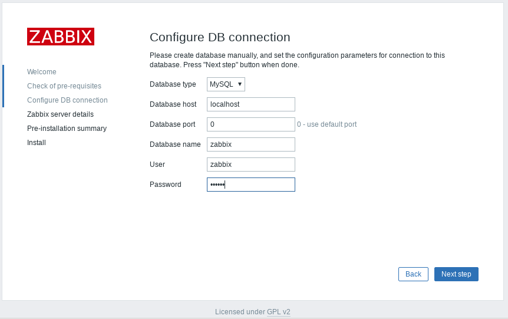
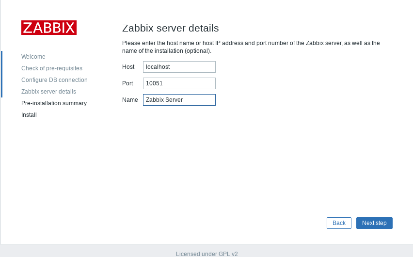
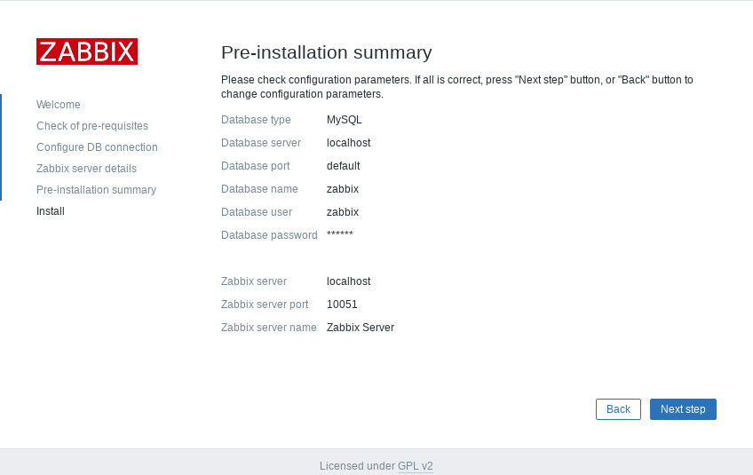
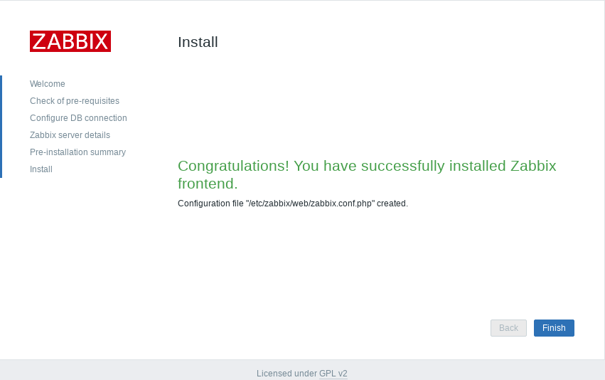
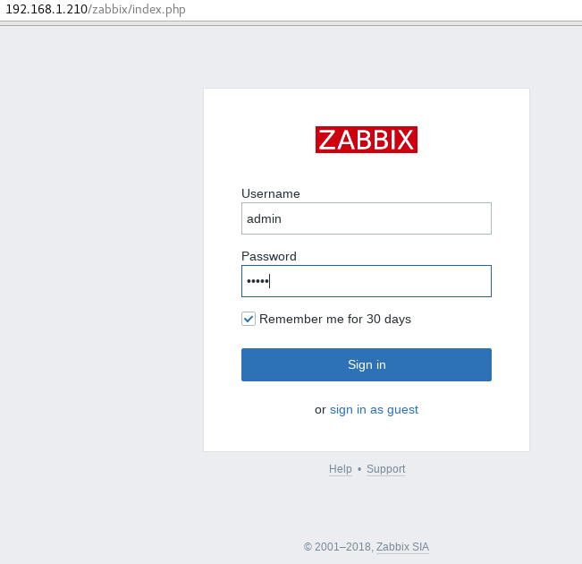

Instalar ZABBIX 3.4 en CentOS 3.4
===================================

La plataforma sera:
ZABBIX versión 3.4 - CentOS 7 - BD MariaDB

Instalamos Prerequisitos.::

	# yum install mariadb-server.x86_64 mariadb.x86_64

	# yum install php-mysql.x86_64 php.x86_64

Si es Oracle Linux le faltaran estos paquetes:
zabbix-web-3.4.13-1.el7.noarch
zabbix-web-3.4.13-1.el7.noarch
Nos vamos a este link y desde ahí los descargamos.
http://yum.oracle.com/repo/OracleLinux/OL7/optional/latest/x86_64/index.html

Los intalamos con rpm.::

	# rpm -ivh php-mbstring-5.4.16-45.el7.x86_64.rpm
	Preparando...                         ################################# [100%]
	Actualizando / instalando...
	   1:php-mbstring-5.4.16-45.el7       ################################# [100%]

	# rpm -ivh php-bcmath-5.4.16-45.el7.x86_64.rpm 
	Preparando...                         ################################# [100%]
	Actualizando / instalando...
	   1:php-bcmath-5.4.16-45.el7         ################################# [100%]

Instalamos y configuramos Zabbix server
+++++++++++++++++++++++++++++++++++++++++

Instalamos repositorios para Zabbix server con MySQL.::

	# rpm -i https://repo.zabbix.com/zabbix/3.4/rhel/7/x86_64/zabbix-release-3.4-2.el7.noarch.rpm

Instalamos Zabbix server, frontend y agente.::

	# yum install zabbix-server-mysql zabbix-web-mysql zabbix-agent

Iniciamos la configuración de MariaDB.::

	# mysql_secure_installation

	NOTE: RUNNING ALL PARTS OF THIS SCRIPT IS RECOMMENDED FOR ALL MariaDB
	      SERVERS IN PRODUCTION USE!  PLEASE READ EACH STEP CAREFULLY!

	In order to log into MariaDB to secure it, we'll need the current
	password for the root user.  If you've just installed MariaDB, and
	you haven't set the root password yet, the password will be blank,
	so you should just press enter here.

	Enter current password for root (enter for none): 
	OK, successfully used password, moving on...

	Setting the root password ensures that nobody can log into the MariaDB
	root user without the proper authorisation.

	Set root password? [Y/n] y 
	New password: r00tme
	Re-enter new password: r00tme
	Password updated successfully!
	Reloading privilege tables..
	 ... Success!

	By default, a MariaDB installation has an anonymous user, allowing anyone
	to log into MariaDB without having to have a user account created for
	them.  This is intended only for testing, and to make the installation
	go a bit smoother.  You should remove them before moving into a
	production environment.

	Remove anonymous users? [Y/n] y
	 ... Success!

	Normally, root should only be allowed to connect from 'localhost'.  This
	ensures that someone cannot guess at the root password from the network.

	Disallow root login remotely? [Y/n] y
	 ... Success!

	By default, MariaDB comes with a database named 'test' that anyone can
	access.  This is also intended only for testing, and should be removed
	before moving into a production environment.

	Remove test database and access to it? [Y/n] y
	 - Dropping test database...
	 ... Success!
	 - Removing privileges on test database...
	 ... Success!

	Reloading the privilege tables will ensure that all changes made so far
	will take effect immediately.

	Reload privilege tables now? [Y/n] y
	 ... Success!

	Cleaning up...

	All done!  If you've completed all of the above steps, your MariaDB
	installation should now be secure.

	Thanks for using MariaDB!

Creamos la base de datos.::

	# mysql -uroot -pr00tme
	Welcome to the MariaDB monitor.  Commands end with ; or \g.
	Your MariaDB connection id is 10
	Server version: 5.5.60-MariaDB MariaDB Server

	Copyright (c) 2000, 2018, Oracle, MariaDB Corporation Ab and others.

	Type 'help;' or '\h' for help. Type '\c' to clear the current input statement.

	MariaDB [(none)]> create database zabbix character set utf8 collate utf8_bin;
	Query OK, 1 row affected (0.00 sec)

	MariaDB [(none)]> grant all privileges on zabbix.* to zabbix@localhost identified by 'r00tme';
	Query OK, 0 rows affected (0.00 sec)

	MariaDB [(none)]> quit;
	Bye

Importamos el schema inicial y la data. Y pedira una clave nueva.::

	# zcat /usr/share/doc/zabbix-server-mysql*/create.sql.gz | mysql -uzabbix -p zabbix
	Enter password:

Configuramos la base de datos para Zabbix server. edite el archivo /etc/zabbix/zabbix_server.conf.::

	vi /etc/zabbix/zabbix_server.conf
	DBName=zabbix
	DBUser=zabbix
	DBPassword=r00tme

Configuramos el PHP para el Zabbix Frontend. Edite el archivo /etc/httpd/conf.d/zabbix.conf, y descomente su zona horario.::

	vi /etc/httpd/conf.d/zabbix.conf
	# php_value date.timezone Europe/Riga
	php_value date.timezone America/Caracas

Iniciamos el Zabbix server y agent processes
Iniciamos el Zabbix server y el  agent processes y que inicie al boot el equipo.::

	# systemctl restart zabbix-server zabbix-agent httpd
	# systemctl enable zabbix-server zabbix-agent httpd

Configuramos  Zabbix frontend
Conectamos y configuramos el Zabbix frontend: http://server_ip_or_name/zabbix

El usuario es "Admin" y la clave "zabbix"

