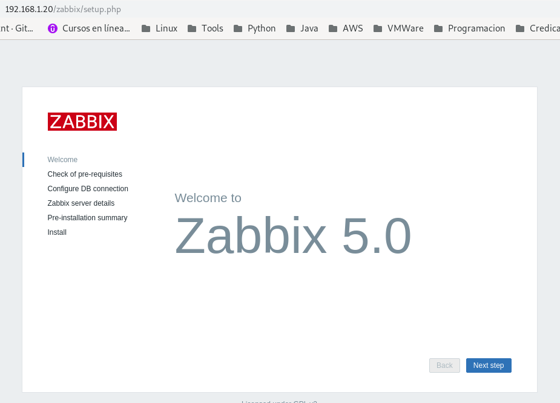
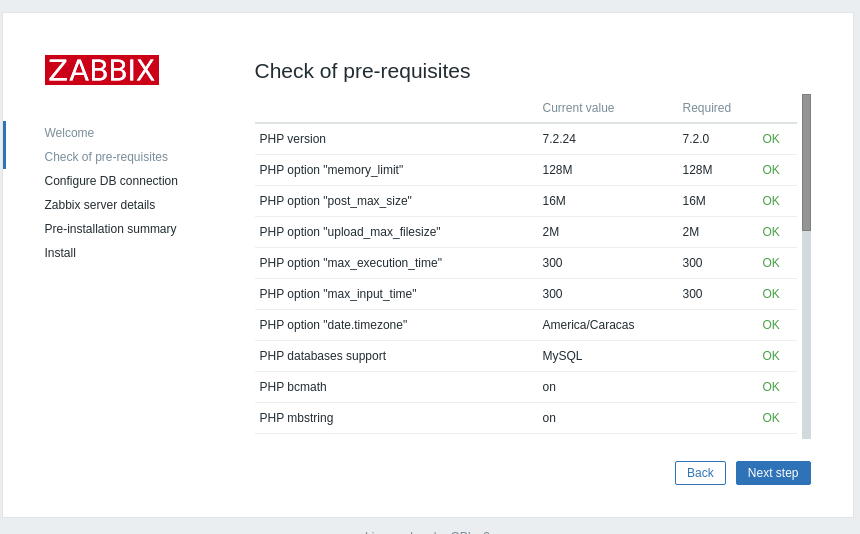
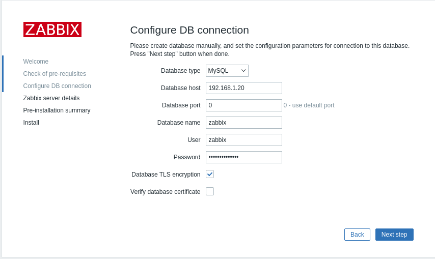
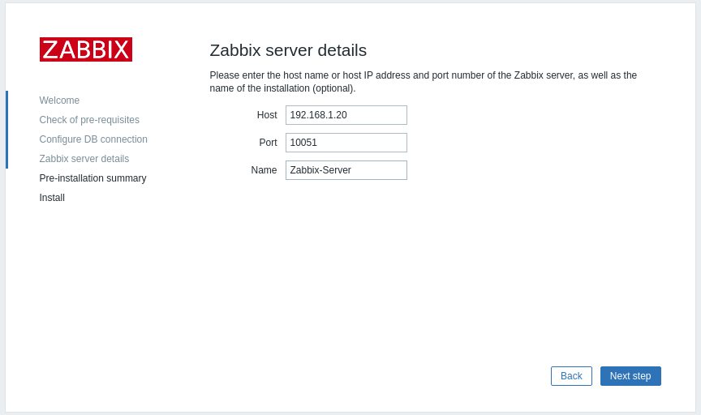
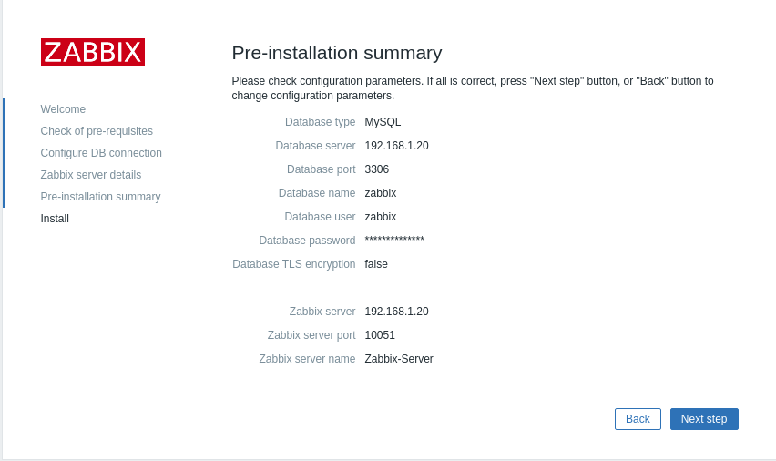
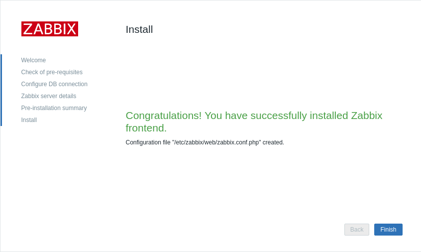
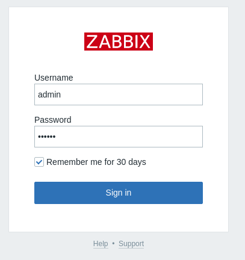
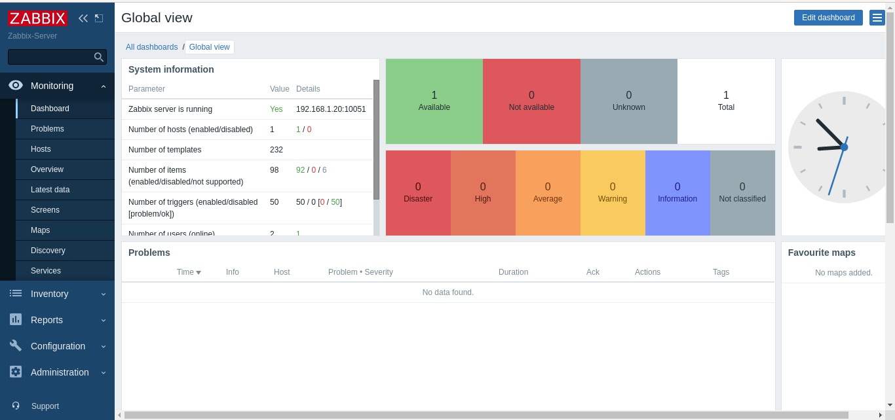

Instalar ZABBIX 5.0 en CentOS 7
===================================

La plataforma sera:
ZABBIX versión 5.0 - CentOS 7 - BD MariaDB 10.6

Instalar EPEL, deshabilitar SELINUX y el Firewall

Actualizamos el Sistema Operativo para tener actualizado los paquetes.::

	# yum update

Instalar MariaDB
+++++++++++++++

Si tenemos ya una versión de MariaDB la podemos desinstalar de esta forma::

	yum remove mariadb-server

Agregamos el repositorio de CentOS 7 server para MariaDB::

	cat <<EOF | sudo tee /etc/yum.repos.d/MariaDB.repo
	[mariadb]
	name = MariaDB
	baseurl = http://yum.mariadb.org/10.6/centos7-amd64
	gpgkey=https://yum.mariadb.org/RPM-GPG-KEY-MariaDB
	gpgcheck=1
	EOF

Para instalar otra version de MariaDB como 10.5 o 10.4 solo remplazamo el 10.6 por uno de los valores antes mencionados.

Indexamos y limpiamos el YUM::

	yum makecache fast

Instalamos MariaDB 10.6 en CentOS 7::

	yum -y install MariaDB-server MariaDB-client

Para ver detalles del paquete instalado::

	rpm -qi MariaDB-server

	Name        : MariaDB-server
	Version     : 10.6.5
	Release     : 1.el7.centos
	Architecture: x86_64
	Install Date: mar 14 dic 2021 14:36:48 EST
	Group       : Applications/Databases
	Size        : 126287400
	License     : GPLv2
	Signature   : DSA/SHA1, sáb 06 nov 2021 17:45:41 EDT, Key ID cbcb082a1bb943db
	Source RPM  : MariaDB-server-10.6.5-1.el7.centos.src.rpm
	Build Date  : vie 05 nov 2021 17:12:42 EDT
	Build Host  : centos74-amd64
	Relocations : (not relocatable)
	Vendor      : MariaDB Foundation
	URL         : http://mariadb.org
	Summary     : MariaDB: a very fast and robust SQL database server
	Description :
	MariaDB: a very fast and robust SQL database server

	It is GPL v2 licensed, which means you can use the it free of charge under the
	conditions of the GNU General Public License Version 2 (http://www.gnu.org/licenses/).

	MariaDB documentation can be found at https://mariadb.com/kb
	MariaDB bug reports should be submitted through https://jira.mariadb.org

Habilitamos e iniciamos MariaDB::

	systemctl enable mariadb

	systemctl start mariadb

	systemctl status mariadb

Aplicamos la seguridad de  MariaDB y el cambio de clave del root de MariaDB, ejecutando mariadb-secure-installation ::

	mariadb-secure-installation 

	NOTE: RUNNING ALL PARTS OF THIS SCRIPT IS RECOMMENDED FOR ALL MariaDB
	      SERVERS IN PRODUCTION USE!  PLEASE READ EACH STEP CAREFULLY!

	In order to log into MariaDB to secure it, we'll need the current
	password for the root user. If you've just installed MariaDB, and
	haven't set the root password yet, you should just press enter here.

	Enter current password for root (enter for none): 
	OK, successfully used password, moving on...

	Setting the root password or using the unix_socket ensures that nobody
	can log into the MariaDB root user without the proper authorisation.

	You already have your root account protected, so you can safely answer 'n'.

	Switch to unix_socket authentication [Y/n] 
	Enabled successfully!
	Reloading privilege tables..
	 ... Success!

	You already have your root account protected, so you can safely answer 'n'.

	Change the root password? [Y/n] n
	 ... skipping.

	By default, a MariaDB installation has an anonymous user, allowing anyone
	to log into MariaDB without having to have a user account created for
	them.  This is intended only for testing, and to make the installation
	go a bit smoother.  You should remove them before moving into a
	production environment.

	Remove anonymous users? [Y/n] 
	 ... Success!

	Normally, root should only be allowed to connect from 'localhost'.  This
	ensures that someone cannot guess at the root password from the network.

	Disallow root login remotely? [Y/n] 
	 ... Success!

	By default, MariaDB comes with a database named 'test' that anyone can
	access.  This is also intended only for testing, and should be removed
	before moving into a production environment.

	Remove test database and access to it? [Y/n] 
	 - Dropping test database...
	 ... Success!
	 - Removing privileges on test database...
	 ... Success!

	Reloading the privilege tables will ensure that all changes made so far
	will take effect immediately.

	Reload privilege tables now? [Y/n] 
	 ... Success!

	Cleaning up...

	All done!  If you've completed all of the above steps, your MariaDB
	installation should now be secure.

	Thanks for using MariaDB!

Verificamos la versión instalada::

	# mysql -V
	mysql  Ver 15.1 Distrib 10.6.5-MariaDB, for Linux (x86_64) using readline 5.1

Creamos la base de datos que se utilizara para zabbix::

	# mysql -uroot -pr00tme

	Welcome to the MariaDB monitor.  Commands end with ; or \g.
	Your MariaDB connection id is 10
	Server version: 5.5.60-MariaDB MariaDB Server

	Copyright (c) 2000, 2018, Oracle, MariaDB Corporation Ab and others.

	Type 'help;' or '\h' for help. Type '\c' to clear the current input statement.

	MariaDB [(none)]> create database zabbix character set utf8 collate utf8_bin;
	Query OK, 1 row affected (0.00 sec)

	MariaDB [(none)]> grant all privileges on zabbix.* to zabbix@localhost identified by 'r00tme';
	Query OK, 0 rows affected (0.00 sec)

	MariaDB [(none)]> quit;
	Bye

Instalamos y configuramos Zabbix server
+++++++++++++++++++++++++++++++++++++++++

Instalamos repositorios para Zabbix server con MySQL.::

	# rpm -Uvh https://repo.zabbix.com/zabbix/5.0/rhel/7/x86_64/zabbix-release-5.0-1.el7.noarch.rpm
	# yum clean all

Instalar Zabbix server y el agente::

	# yum install zabbix-server-mysql zabbix-agent

Instalar Zabbix frontend. 
+++++++++++++++++++++++++

Habilitamos la Colección de Red Hat Software::

	# yum install centos-release-scl

Editamos el archivo /etc/yum.repos.d/zabbix.repo y habilitamos el repositorio de zabbix-frontend::

	[zabbix-frontend]
	...
	enabled=1
	...
Instalar Zabbix frontend packages:: 

	# yum install zabbix-web-mysql-scl zabbix-apache-conf-scl

Crear e inicializar la Base de Datos
+++++++++++++++++++++++++++++++++++++++

Estar seguros que la Base de Datos este running.

Ejecutar lo siguiente en el servidor en donde esta la Base de Datos::

	# mysql -uroot -pr00tme
	
	mysql> create database zabbix character set utf8 collate utf8_bin;
	mysql> create user zabbix@localhost identified by 'zabbixpassword';
	mysql> grant all privileges on zabbix.* to zabbix@localhost;
	mysql> GRANT ALL PRIVILEGES ON zabbix.* TO 'zabbix'@'%' IDENTIFIED BY 'zabbixpassword' WITH GRANT OPTION;
	mysql> GRANT ALL PRIVILEGES ON zabbix.* TO 'zabbix'@'192.168.1.20' IDENTIFIED BY 'zabbixpassword' WITH GRANT OPTION;
	mysql> quit;

Hacemos un test.::

	# mysql -h 192.168.1.20 -u zabbix -p

En el servidor de Zabbix importamos los schemas iniciales y de data. Pedirá que introduzca el nuevo password creado en el paso anterior::

	# zcat /usr/share/doc/zabbix-server-mysql*/create.sql.gz | mysql -uzabbix -p zabbix

Configurar la Base de Datos para el servidor de Zabbix
++++++++++++++++++++++++++++++++++++++++++++++++++++++

Editar el archivo /etc/zabbix/zabbix_server.conf::

	DBPassword=zabbixpassword

Configurar el PHP para el Zabbix Frontend
++++++++++++++++++++++++++++++++++++++++++

Editar el archivo /etc/opt/rh/rh-php72/php-fpm.d/zabbix.conf, descomentar y/o configurar el timezone de nuestra preferencia::

	vi /etc/opt/rh/rh-php72/php-fpm.d/zabbix.conf
	;php_value date.timezone Europe/Riga
	php_value[date.timezone] = America/Caracas

Iniciamos el Zabbix server y agent processes
+++++++++++++++++++++++++++++++++++++++++++++

Iniciamos el Zabbix server y el  agent processes y que inicie al boot el equipo.::

	# systemctl restart zabbix-server zabbix-agent httpd rh-php72-php-fpm
	# systemctl enable zabbix-server zabbix-agent httpd rh-php72-php-fpm

Configuramos  Zabbix frontend
+++++++++++++++++++++++++++++

Configure Zabbix frontend

Conectamos y configuramos el Zabbix frontend: http://server_ip_or_name/zabbix

El usuario es "Admin" y la clave "zabbix"

