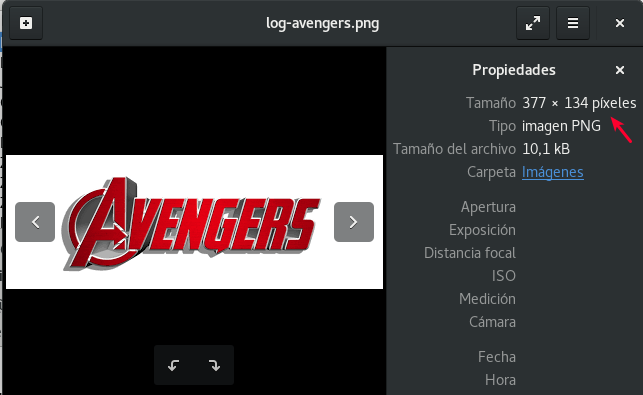
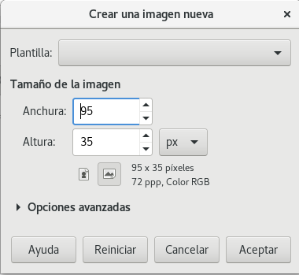
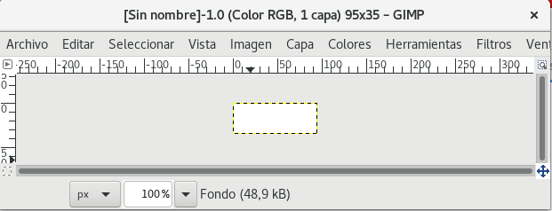
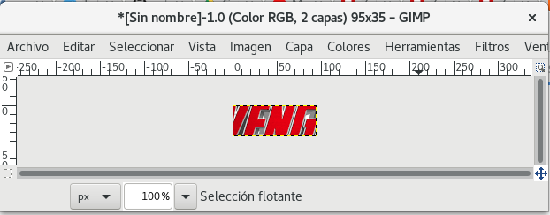
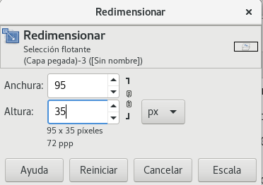
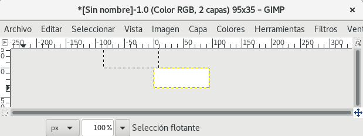

Personalizar Logo de Zabbix 3.x
================================

Lo primero que debemos hacer es crear nuestro archivo png con el siguiente escala "95 x 35"

Crear el logo con GIMP
+++++++++++++++++++++++ 

Esta es la imagen que vamos a modificar

Abrimos GIMP y le indicamos y le damos archivo Nuevo, en anchura ponemos 95 y en altura 35

Ya tenemos el area de trabajo

Ahora copiamos la imagen y le damos pegar en el área de trabajo del GIMP

Seleccionamos Herramientas y luego Herramientas de transformación y luego escalar. 

Volvemos a colocar los valores de ancho 95 y altura 35

Ya tenemos la imagen con el tamaño, falta moverla.

Ahora la movemos al área de trabajo, Herramientas y luego Herramientas de Selección y luego Selección rectangular y movemos la imagen

.. figure:: ../images/changelogo/07.png

Listo, ahora guardamos el archivo con xcf

.. figure:: ../images/changelogo/08.png

Y por ultimo lo exportamos a un archivo png

Desplegar el Logo en Zabbix
++++++++++++++++++++++++++++++

Vamos a modificar El logo de la barra de menú, El logo de ingreso y el icono de la pestaña del navegador.

Las imágenes se almacenan en:
/usr/share/zabbix/img

Y los temas se almacenan en:
/usr/share/zabbix/styles

Respaldamos en "/usr/share/zabbix/" el "favicon.ico" y copiamos el log en "/usr/share/zabbix/" con el nombre de "favicon.ico", con eso ya cambiamos el icono de la pestaña del navegador.::

	/usr/share/zabbix/favicon.ico

Copiamos el logo en "/usr/share/zabbix/img"

editar el archivo blue-theme.css el cual se encuentra en la siguiente ruta /usr/share/zabbix/styles/
Para cambiar el logo de ingreso modificaremos el background  url::

	.signin-logo {
	  margin: 0 auto;
	  margin-bottom: 21px;
	  width: 114px;
	  height: 30px;
	  background: url(../img/icon-sprite.svg) no-repeat 0 -864px; }

Por::

	.signin-logo {
	  margin: 0 auto;
	  margin-bottom: 21px;
	  width: 114px;
	  height: 30px;
	  background: url(../img/avenger) no-repeat 0 -0px; }

Y para cambiar el logo de la barra de menú modificaremos el background url::

	.logo {
	  float: left;
	  display: block;
	  width: 95px;
	  height: 25px;
	  background: url(../img/icon-sprite.svg) no-repeat 0 -903px; }

Por::

	.logo {
	  float: left;
	  display: block;
	  width: 95px;
	  height: 25px;
	  background: url(../img/avengers.png) no-repeat 0 -0px; }

Una vez realizado lo indicado procederemos a guardar los cambios en el archivo blue-theme.css

