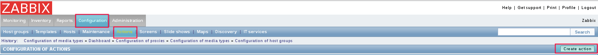

Configurar Telegram para Zabbix
=================================

Debemos tener creador el bot en telegram, tener el codigo API o TOKEN, recuerde que el numero cel que cree el bot sera el dueño de dicho bot.

Tambien hay que estar pendiente cuando exista una actualizacion de Telegram, porque los modulos de "python-telegram-bot" y "pip3.4 install pyTelegramBotAPI" y el mismo python pueden quedar obsoletos.

Ahora tendremos que crear en nuestro telegram un grupo donde agregaremos a todas las personas que necesitamos que sean notificadas, incluyendo al bot que creamos.

Enviaremos un mensaje al grupo que recien hemos creado, le mandamos /token.

Una vez enviado el mensaje debemos optener el id del grupo de telegram. Como lo obtenemos?
En nuestro browser colocaremos el token de acceso que nos proporciono el bot BotFather
https://api.telegram.org/bot327956367:777774Im0333333Q3bhz9I5yfHhvS5RuG_0/getupdates
Con estos dos datos, el token de acceso y el id del grupo comenzaremos a configurar nuestro zabbix

.. figure:: ../images/telegram/01.png

Debemos instalar python 3.4.5 sin que sustituya el que se encuentra instalado (IMPORTANTE) aqui en el repositorio de Centos lo puedes buscar.

Instalamos los requisitos.::

	# pip3.4 install python-telegram-bot
	# pip3.4 install pyTelegramBotAPI

Una vez instalado el API buscaremos la ruta donde estan instalados los script de alertas.::

	# grep -i Alerts /etc/zabbix/zabbix_server.conf
	#	How often Zabbix will try to send unsent alerts (in seconds).
	### Option: AlertScriptsPath
	# AlertScriptsPath=${datadir}/zabbix/alertscripts
	AlertScriptsPath=/usr/lib/zabbix/alertscripts

Ingresamos a la ruta.::

	# cd /usr/lib/zabbix/alertscripts

Procederemos a crear el siguiente script que enviara la informacion al grupo de Telegram por medio del bot.::

	# vi telegram

	#!/usr/bin/env /usr/local/bin/python3.4
	# Si la linea de arriba no tiene correcta la direccion de python 3.4 no funciona.

	import telebot,sys

	BOT_TOKEN='327956367:777774Im0333333Q3bhz9I5yfHhvS5RuG_0'
	DESTINATION=sys.argv[1]
	SUBJECT=sys.argv[2]
	MESSAGE=sys.argv[3]

	MESSAGE = MESSAGE.replace('/n','\n')

	tb = telebot.TeleBot(BOT_TOKEN)
	tb.send_message(DESTINATION,SUBJECT + '\n' + MESSAGE)

Donde en BOT_TOKEN debera colocar el codigo token porporcionado por el bot.

Procederemos a dar permiso de ejecucion al script telegram y que el usuario propietario sea el usuario zabbix.::

Se indica que el dueño del archivo es el usuario zabbix.::

	# chmod +x telegram && chown zabbix: telegram

Verificamos lo indicado.::

	# ls -l
	total 12
	-rwxr-xr-x 1 zabbix zabbix 328 abr 30 00:29 telegram

Para probar lo indicado ejecutaremos el script seguido del id del grupo y debe llegar el mensage al grupo de Telegram.:: 

	# ./telegram -227068067 PRUEBA ZABBIX

Vemos como llega al grupo de telegram.

NOTA: cuando es grupo lleva el signo (-) y si es un privado no se le coloca el signo

Hemos comprobado que el script esta trabajando correctamente, ahora a configurar via web zabbix para que envie las alarmas via telegram.

Media type
+++++++++++

En la interfaz de Zabbix ir, go to Adminstration, Media types, y click en Create media type.

.. figure:: ../images/telegram/03.png

.::

	Name: telegram
	Type: Script
	Script name: telegram

	Si usamos Zabbix 3.0.1:

	Script Parameters
	{ALERT.SENDTO}
	{ALERT.SUBJECT}
	{ALERT.MESSAGE}

Actions
++++++++

Ahora ir a Configuration, Actions y click en Create Action.

.::

	Name: Report problems to Zabbix administrators
	Default Subject: #{HOSTNAME}: {TRIGGER.NAME} {TRIGGER.STATUS}
	Default Message:
	Trigger: {TRIGGER.NAME}
	Trigger status: {TRIGGER.STATUS}
	Trigger severity: {TRIGGER.SEVERITY}
	Trigger URL: {TRIGGER.URL}

	Item values:

	1. {ITEM.NAME1} ({HOST.NAME1}:{ITEM.KEY1}): {ITEM.VALUE1}
	2. {ITEM.NAME2} ({HOST.NAME2}:{ITEM.KEY2}): {ITEM.VALUE2}
	3. {ITEM.NAME3} ({HOST.NAME3}:{ITEM.KEY3}): {ITEM.VALUE3}

Original event ID: {EVENT.ID}

Los campos Subject y Message soportan configuracion HTML. HTML tags supported.::

	<b>bold</b>, <strong>bold</strong>
	<i>italic</i>, <em>italic</em>
	<a href="URL">inline URL</a>
	<code>inline fixed-width code</code>
	<pre>pre-formatted fixed-width code block</pre>

Ir al tab Conditions y agregar las configuraciones que requieras.

Ir al tab Actions y agregar las configuracions que se requieran.

Users
+++++++

El ultimo paso es crear un usuario de solo lectura para que pueda recibir las alertas de los triggers y que se envie a la media que se creo para Telegram.

Ir a Administration, Users y seleccionar el usuario. Entonces, ir a Media y click en Add.::

	Type: telegram
	Send to: ID | Telegram ID es es el valor que ya capturamos al principio.

Listo ya ahora todos los triggers que se activen seran enviados al Grupo del Telegram. Recuerda que en Action pueden crear action mas especificos, es decir, para que solo envie los mensajes de ciertos triggers o de servidores o de grupos.

