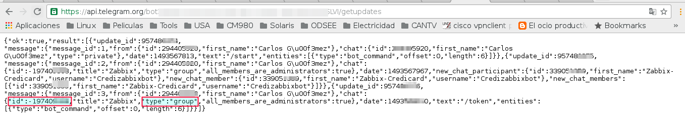
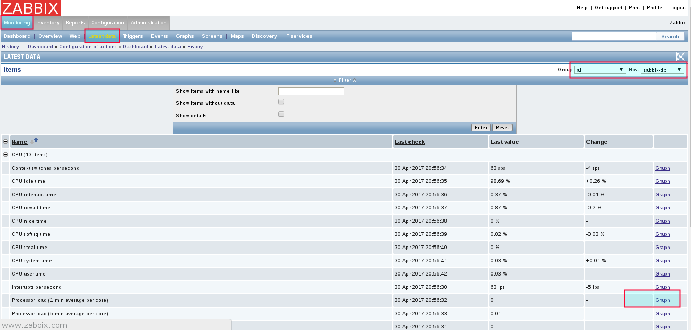

Configurar Telegram Graphic para Zabbix
=========================================

Debemos tener creador el bot en telegram, tener el codigo API o TOKEN, recuerde que el numero cel que cree el bot sera el dueño de dicho bot.

Tambien hay que estar pendiente cuando exista una actualizacion de Telegram, porque los modulos de "python-telegram-bot" y "pip3.4 install pyTelegramBotAPI" y el mismo python pueden quedar obsoletos.

Ahora tendremos que crear en nuestro telegram un grupo donde agregaremos a todas las personas que necesitamos que sean notificadas, incluyendo al bot que creamos.

Enviaremos un mensaje al grupo que recien hemos creado, le mandamos /token.

Una vez enviado el mensaje debemos optener el id del grupo de telegram. Como lo obtenemos?
En nuestro browser colocaremos el token de acceso que nos proporciono el bot BotFather
https://api.telegram.org/bot327956367:777774Im0333333Q3bhz9I5yfHhvS5RuG_0/getupdates
Con estos dos datos, el token de acceso y el id del grupo comenzaremos a configurar nuestro zabbix

Una vez instalado el API buscaremos la ruta donde estan instalados los script de alertas.::

	# grep -i Alerts /etc/zabbix/zabbix_server.conf
	#	How often Zabbix will try to send unsent alerts (in seconds).
	### Option: AlertScriptsPath
	# AlertScriptsPath=${datadir}/zabbix/alertscripts
	AlertScriptsPath=/usr/lib/zabbix/alertscripts

Ingresamos a la ruta.::

	# cd /usr/lib/zabbix/alertscripts

Procederemos a crear el siguiente script que enviara la informacion al grupo de telegram por medio del bot. este script el autor original es de "https://github.com/diegosmaia/zabbix-telegram" pero coloco este porque fue modificado para la version de ZABBIX 2.2.::

	#!/bin/bash

	##########################################################################
	# Zabbix-Telegram envio de alerta por Telegram com graficos dos eventos
	# Filename: zabbix-telegram.sh
	# Revision: 2.2
	# Date: 07/02/2017
	# Author: Diego Maia - diegosmaia@yahoo.com.br Telegram - @diegosmaia
	# Aproveitei algumas coisas:
	# Script getItemGraph.sh Author: Qicheng
	# https://github.com/GabrielRF/Zabbix-Telegram-Notification @GabrielRF
	# Obs.: Caso esqueci de alguem, por favor, me chame no Telegram que adiciono
	# Modificado por: Carlos Gomez Gomez
	##########################################################################

	MAIN_DIRECTORY="/usr/lib/zabbix/alertscripts/"

	USER=$1
	SUBJECT=$2
	SUBJECT="${SUBJECT//,/ }"
	MESSAGE="chat_id=${USER}&text=$3"
	GRAPHID=$3
	GRAPHID=$(echo $GRAPHID | awk -F"[" '{print $2}' | tr -d "]")
	# GRAPHID=$(echo $GRAPHID | grep -o -E "(Item Graphic: \[[0-9]{7}\])|(Item Graphic: \[[0-9]{6}\])|(Item Graphic: \[[0-9]{5}\])|(Item Graphic: \[[0-9]{4}\])|(Item Graphic: \[[0-9]{3}\])")
	# GRAPHID=$(echo $GRAPHID | grep -o -E "([0-9]{7})|([0-9]{6})|([0-9]{5})|([0-9]{4})|([0-9]{3})")
	ITEMID=$GRAPHID
	ZABBIXMSG="/tmp/zabbix-message-$(date "+%Y.%m.%d-%H.%M.%S").tmp"

	echo "Probando echo"
	echo $GRAPHID 
	echo $ITEMID

	#############################################
	# Endereço do Zabbix
	#############################################
	ZBX_URL="http://192.168.1.6/zabbix"

	##############################################
	# Conta de usuário para logar no site Zabbix
	##############################################

	USERNAME="carlos.gomez"
	PASSWORD="Venezuela21"

	############################################
	# O Bot-Token do exemplo, tem que modificar
	############################################

	BOT_TOKEN='327956367:AAHh4Im0dXwel2zQ3bhz9I5yfHhvS5RuG_0'

	#############################################
	# Se nao desejar enviar GRAFICO / ENVIA_GRAFICO = 0
	# Se nao desejar enviar MESSAGE / ENVIA_MESSAGE = 0
	#############################################

	ENVIA_GRAFICO=1
	ENVIA_MESSAGE=1

	# Se não receber o valor de GRAPHID ele seta o valor de ENVIA_GRAFICO para 0

	case $GRAPHID in
		''|*[!0-9]*) ENVIA_GRAFICO=0 ;;
	esac

	##############################################
	# Graficos
	##############################################

	WIDTH=800
	CURL="/usr/bin/curl"
	COOKIE="/tmp/telegram_cookie-$(date "+%Y.%m.%d-%H.%M.%S")"
	PNG_PATH="/tmp/telegram_graph-$(date "+%Y.%m.%d-%H.%M.%S").png"

	############################################
	# Periodo do grafico em minutos Exp: 10800min/3600min=3h 
	############################################

	PERIOD=10800

	###########################################
	# Verifica se foi passado os 3 parametros
	# para o script
	###########################################

	if [ "$#" -lt 3 ]
	then
		exit 1
	fi

	############################################
	# Envio dos graficos
	############################################

	# Se ENVIA_GRAFICO=1 ele envia o gráfico.
	if [ $(($ENVIA_GRAFICO)) -eq '1' ]; then
		############################################
		# Zabbix logando com o usuário no site
		############################################

	   	# Zabbix - Ingles - Verifique no seu Zabbix se na tela de login se o botao de login é "Sign in".
		# Obs.: Caso queira mudar, abra a configuração do usuário Guest e mude a linguagem para Portugues, se fizer isso comente (#) a linha abaixo e descomente a linha Zabbix-Portugues.

			${CURL} -k -s -c ${COOKIE} -b ${COOKIE} -d "name=${USERNAME}&password=${PASSWORD}&autologin=1&enter=Sign%20in" ${ZBX_URL}"/index.php" # > /dev/null

	  	# Download do gráfico e envio
		       ${CURL} -k -s -c ${COOKIE}  -b ${COOKIE} -d "itemids=${GRAPHID}&itemid=${ITEMID}&period=${PERIOD}&width=${WIDTH}" ${ZBX_URL}"/chart.php" -o "${PNG_PATH}";

		${CURL} -k -s -X POST "https://api.telegram.org/bot${BOT_TOKEN}/sendPhoto" -F chat_id="${USER}" -F photo="@${PNG_PATH}"  # > /dev/null

	fi

	############################################
	# DEBUG
	############################################

	# Verificar valores recebidos do Zabbix ou do prompt
	# cat /tmp/telegram-debug.txt
	# echo "User-Telegram=$USER | Subject=$SUBJECT | Menssage=$MESSAGE | GraphID=${GRAPHID} | Period=${PERIOD} | Width=${WIDTH}" >/tmp/telegram-debug.txt

	# Teste com curl tentando baixar o gráfico
	# Verifique o arquivo /tmp/telegram-graph.png no seu computador para ver se o grafico esta sendo gerado corretamente
	# ${CURL} -k -c ${COOKIE}  -b ${COOKIE} -d "graphid=1459&itemids=1459&period=10800&width=800" 192.168.10.24/zabbix/chart.php > /tmp/telegram-graph.png

	#Verificando o envio da msg

	############################################
	# Apagando os arquivos utilizados no script
	############################################

	rm -f ${COOKIE}

	rm -f ${PNG_PATH}

	# Desabilita se precisar verificar o arquivo /tmp/zabbix-message-{datetime}.tmp, ele contem os dados enviados pelo Zabbix
	rm -f ${ZABBIXMSG}
	exit 0

Modificar el valor de variable ZBX_URL para o ip del servidor Zabbix.::

	############################################# 
	# Endereço do Zabbix 
	############################################# 
	ZBX_URL="http://192.168.1.6/zabbix" 

Modificar o las variables de USERNAME Y PASSWORD con la de un usuario valido en ZABBIX.::

	############################################## 
	# Conta de usuário para logar no site Zabbix 
	############################################## 
	USERNAME="carlos.gomez" 
	PASSWORD="zabbix" 

Colocar el valor del TOKEN de su bot en la variable BOT_TOKEN.::

	############################################ 
	# O Bot-Token do exemplo, tem que modificar 
	############################################ 
	BOT_TOKEN='327956367:777774Im0333333Q3bhz9I5yfHhvS5RuG_0' 

Cambiar estos valores si no quieren que se envien los Graficos o Mensajes.::

	############################################# 
	# Se nao desejar enviar GRAFICO / ENVIA_GRAFICO = 0 
	# Se nao desejar enviar MESSAGE / ENVIA_MESSAGE = 0 
	############################################# 
	ENVIA_GRAFICO=1 
	ENVIA_MESSAGE=1

Si queremos aumentar el tamaño del gráfico.::

	############################################## 
	# Graficos 
	############################################## 
	WIDTH=800 

Caso quira aumentar el período del gráfico de 3h.::

	############################################ 
	# Periodo do grafico em minutos Exp: 10800min/3600min=3h 
	############################################ 
	PERIOD=10800 

Probar antes el script, si no funciona NO continuar.
+++++++++++++++++++++++++++++++++++++++++++++++++++++++

Abrir Zabbix browser en la opcion “Monitoring → Latest Data” y abrimos un grafico qeu tenga data.::

http://192.168.1.6/zabbix/history.php?action=showgraph&itemid=24152&sid=4c6d26afc44a5b18

El comando para verificar es.::

	zabbix-telegram.sh Group-ID Subject "Item Graphic: [graficoID]"

	/usr/lib/zabbix/alertscripts$ ./zabbix-telegram.sh -227067757 "teste UP" "Item Graphic: [24152] "

Hemos comprobado que el script esta trabajando correctamente, ahora a configurar via web zabbix para que envie las alarmas via telegram.

Media type
+++++++++++

En la interfaz de Zabbix ir, go to Adminstration, Media types, y click en Create media type.

.::

	Name: Telegram Graphic
	Type: Script
	Script name: zabbix-telegram.sh

	Si usamos Zabbix 3.0.1:

	Script Parameters
	{ALERT.SENDTO}
	{ALERT.SUBJECT}
	{ALERT.MESSAGE}

Actions
++++++++

Ahora ir a Configuration, Actions y click en Create Action.

.::

	Name: Report problems to Zabbix administrators
	Default Subject: #{HOSTNAME}: {TRIGGER.NAME} {TRIGGER.STATUS}
	Default Message:
	Item Graphic:[{ITEM.ID1}]

Ir al tab Conditions y agregar las configuraciones que requieras.

Ir al tab Actions y agregar las configuracions que se requieran.

Users
+++++++

El ultimo paso es crear un usuario de solo lectura para que pueda recibir las alertas de los triggers y que se envie a la media que se creo para Telegram.

Ir a Administration, Users y seleccionar el usuario. Entonces, ir a Media y click en Add.::

	Type: telegram
	Send to: ID | Telegram ID es es el valor que ya capturamos al principio.

.. figure:: ../images/telegramgraphic/08.png

.. figure:: ../images/telegramgraphic/09.png

Listo ya ahora todos los triggers que se activen seran enviados al Grupo del Telegram. Recuerda que en Action pueden crear action mas especificos, es decir, para que solo envie los mensajes de ciertos triggers o de servidores o de grupos.

