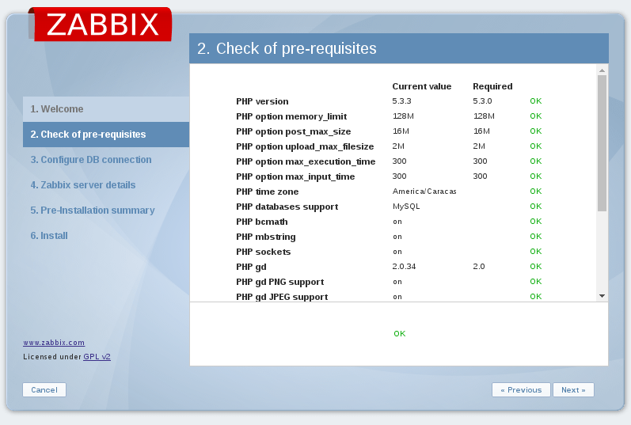
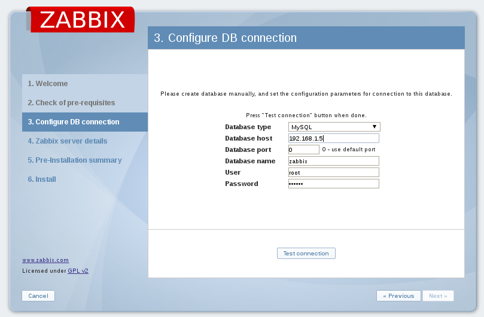
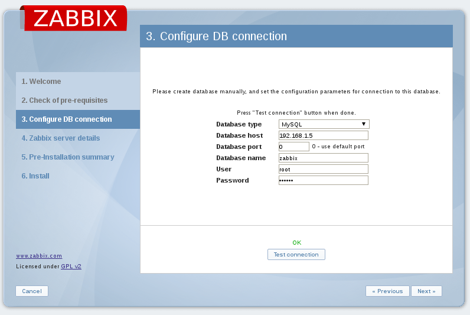
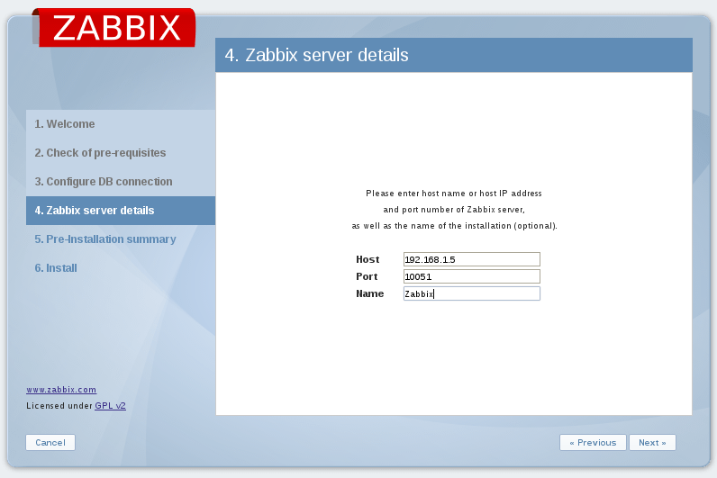
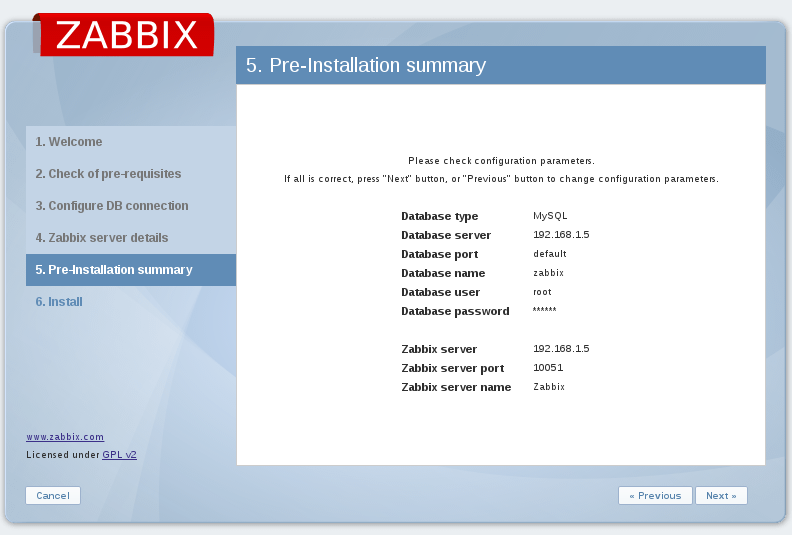
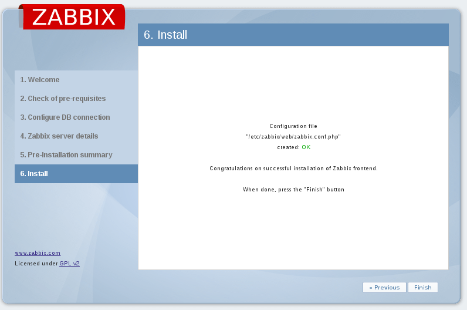

Configurar Zabbix trapper
==========================

Creamos un Item dentro del Host

Si el host no tiene el zabbix_sender lo copiamos del zabbix server.::

	# scp /usr/local/bin/zabbix_* 192.168.1.2:/usr/local/bin/
	root@192.168.1.2's password: 
	zabbix_get                                                                                 100%  278KB 278.5KB/s   00:00    
	zabbix_sender  

Nos vamos al host y ejecutamos el comando zabbix-send.::

	# zabbix_sender -vv -z 192.168.1.5 -p 10051 -s "debian" -k Test -o 7
	zabbix_sender [5890]: DEBUG: answer [{
		"response":"success",
		"info":"processed: 1; failed: 0; total: 1; seconds spent: 0.000117"}]
	info from server: "processed: 1; failed: 0; total: 1; seconds spent: 0.000117"
	sent: 1; skipped: 0; total: 1

Donde:
-z debe ser la ip del servidor zabbix.
-p el puerto por donde el servidor zabbix escucha las peticiones de los Host.
-s debe ser el nombre tal cual como se registro en el zabbix server.
-k fue la key que le configuramos cuando estabmos creando el Item
-o es el valor que queramos que grafique.

Veamos como ver si el valor en el zabbix server

