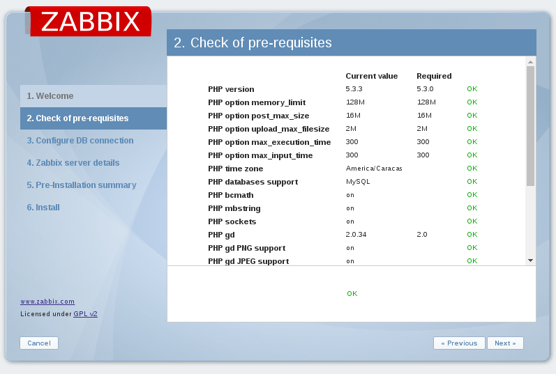
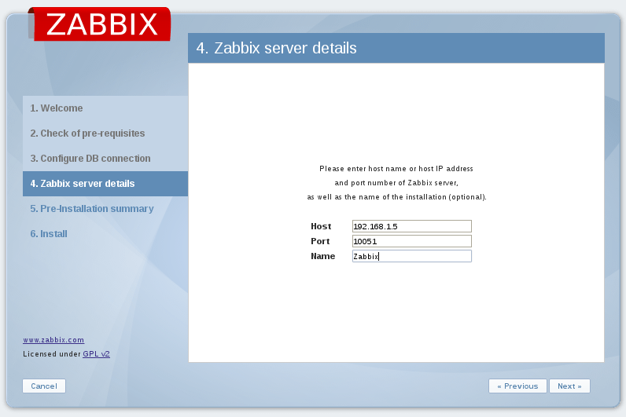
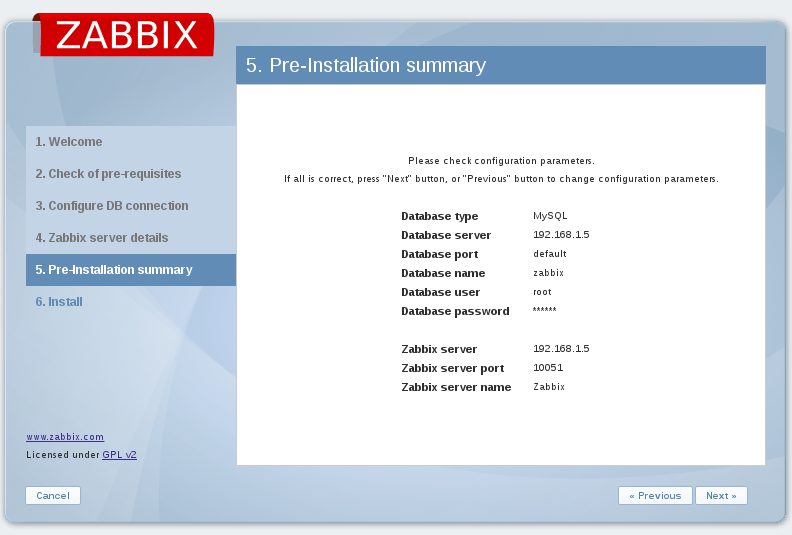
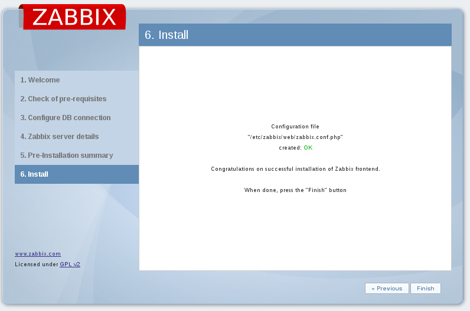

Configurar trigger
===================

Creamos un trigger dentro del Host

.. figure:: ../images/01.png

.. figure:: ../images/03.png

.. figure:: ../images/04.png

Ahora vemos en el dashboard cuando un valor sea mayor lanza el trigger

